<div class="MCWHeader1">
Predictive Maintenance for remote field devices
</div>

<div class="MCWHeader2">
Hands-on lab step-by-step
</div>

<div class="MCWHeader3">
May 2021
</div>

Information in this document, including URL and other Internet Web site references, is subject to change without notice. Unless otherwise noted, the example companies, organizations, products, domain names, e-mail addresses, logos, people, places, and events depicted herein are fictitious, and no association with any real company, organization, product, domain name, e-mail address, logo, person, place or event is intended or should be inferred. Complying with all applicable copyright laws is the responsibility of the user. Without limiting the rights under copyright, no part of this document may be reproduced, stored in or introduced into a retrieval system, or transmitted in any form or by any means (electronic, mechanical, photocopying, recording, or otherwise), or for any purpose, without the express written permission of Microsoft Corporation.

Microsoft may have patents, patent applications, trademarks, copyrights, or other intellectual property rights covering subject matter in this document. Except as expressly provided in any written license agreement from Microsoft, the furnishing of this document does not give you any license to these patents, trademarks, copyrights, or other intellectual property.

The names of manufacturers, products, or URLs are provided for informational purposes only and Microsoft makes no representations and warranties, either expressed, implied, or statutory, regarding these manufacturers or the use of the products with any Microsoft technologies. The inclusion of a manufacturer or product does not imply endorsement of Microsoft of the manufacturer or product. Links may be provided to third party sites. Such sites are not under the control of Microsoft and Microsoft is not responsible for the contents of any linked site or any link contained in a linked site, or any changes or updates to such sites. Microsoft is not responsible for webcasting or any other form of transmission received from any linked site. Microsoft is providing these links to you only as a convenience, and the inclusion of any link does not imply endorsement of Microsoft of the site or the products contained therein.

© 2021 Microsoft Corporation. All rights reserved.

Microsoft and the trademarks listed at <https://www.microsoft.com/en-us/legal/intellectualproperty/Trademarks/Usage/General.aspx> are trademarks of the Microsoft group of companies. All other trademarks are property of their respective owners.

**Contents**

<!-- TOC -->

- [Predictive Maintenance for remote field devices hands-on lab step-by-step](#predictive-maintenance-for-remote-field-devices-hands-on-lab-step-by-step)
  - [Abstract and learning objectives](#abstract-and-learning-objectives)
  - [Overview](#overview)
  - [Solution architecture](#solution-architecture)
  - [Requirements](#requirements)
  - [Before the hands-on lab](#before-the-hands-on-lab)
  - [Exercise 1: Configuring IoT Central with devices and metadata](#exercise-1-configuring-iot-central-with-devices-and-metadata)
    - [Task 1: Model the telemetry data](#task-1-model-the-telemetry-data)
    - [Task 2: Create an IoT Central application](#task-2-create-an-iot-central-application)
    - [Task 3: Create the Device Template](#task-3-create-the-device-template)
    - [Task 4: Create and provision real devices](#task-4-create-and-provision-real-devices)
  - [Exercise 2: Run the Rod Pump Simulator](#exercise-2-run-the-rod-pump-simulator)
    - [Task 1: Record device connection information](#task-1-record-device-connection-information)
    - [Task 2: Open the Visual Studio solution, and update connection string values](#task-2-open-the-visual-studio-solution-and-update-connection-string-values)
    - [Task 3: Run the application](#task-3-run-the-application)
    - [Task 4: Interpret telemetry data](#task-4-interpret-telemetry-data)
    - [Task 5: Restart a failing pump remotely](#task-5-restart-a-failing-pump-remotely)
  - [Exercise 3: Creating a device group](#exercise-3-creating-a-device-group)
    - [Task 1: Create a device group using a filter](#task-1-create-a-device-group-using-a-filter)
  - [Exercise 4: Creating a useful dashboard](#exercise-4-creating-a-useful-dashboard)
    - [Task 1: Clearing out the default dashboard](#task-1-clearing-out-the-default-dashboard)
    - [Task 2: Add your company logo](#task-2-add-your-company-logo)
    - [Task 3: Add a list of Texas Rod Pumps](#task-3-add-a-list-of-texas-rod-pumps)
    - [Task 4: Add a map displaying the locations of the Texas Rod Pumps](#task-4-add-a-map-displaying-the-locations-of-the-texas-rod-pumps)
  - [Exercise 5: Create an Event Hub and continuously export data from IoT Central](#exercise-5-create-an-event-hub-and-continuously-export-data-from-iot-central)
    - [Task 1: Create an Event Hub](#task-1-create-an-event-hub)
    - [Task 2: Configure continuous data export from IoT Central](#task-2-configure-continuous-data-export-from-iot-central)
  - [Exercise 6: Use Azure Databricks and Azure Machine Learning service to train and deploy predictive model](#exercise-6-use-azure-databricks-and-azure-machine-learning-service-to-train-and-deploy-predictive-model)
    - [Task 1: Run the Anomaly Detection notebook](#task-1-run-the-anomaly-detection-notebook)
  - [Exercise 7: Create an Azure Function to predict pump failure](#exercise-7-create-an-azure-function-to-predict-pump-failure)
    - [Task 1: Create an Azure Function Application](#task-1-create-an-azure-function-application)
    - [Task 2: Create a notification table in Azure Storage](#task-2-create-a-notification-table-in-azure-storage)
    - [Task 3: Create a notification queue in Azure Storage](#task-3-create-a-notification-queue-in-azure-storage)
    - [Task 4: Create notification service in Microsoft Power Automate](#task-4-create-notification-service-in-microsoft-power-automate)
    - [Task 5: Obtain connection settings for use with the Azure Function implementation](#task-5-obtain-connection-settings-for-use-with-the-azure-function-implementation)
    - [Task 6: Create the local settings file for the Azure Functions project](#task-6-create-the-local-settings-file-for-the-azure-functions-project)
    - [Task 7: Review the Azure Function code](#task-7-review-the-azure-function-code)
    - [Task 8: Run the Function App locally](#task-8-run-the-function-app-locally)
    - [Task 9: Prepare the Azure Function App with settings](#task-9-prepare-the-azure-function-app-with-settings)
    - [Task 10: Deploy the Function App into Azure](#task-10-deploy-the-function-app-into-azure)
  - [After the hands-on lab](#after-the-hands-on-lab)
    - [Task 1: Delete Lab Resources](#task-1-delete-lab-resources)

<!-- /TOC -->

# Predictive Maintenance for remote field devices hands-on lab step-by-step

## Abstract and learning objectives

In this hands-on lab, you will build an end-to-end industrial IoT solution. We will begin by leveraging the Azure IoT Central SaaS offerings to stand up a fully functional remote monitoring solution quickly. Azure IoT Central provides solutions built upon recommendations found in the [Azure IoT Reference Architecture](https://docs.microsoft.com/en-us/azure/architecture/reference-architectures/iot/). We will customize this system specifically for rod pumps. Rod pumps are standard industrial equipment found in the oil and gas industry. We will then establish a model for the telemetry data received from the pump systems in the field and use this model to deploy simulated devices for system testing purposes.

Furthermore, we will establish threshold rules in the remote monitoring system that will monitor the incoming telemetry data to ensure all equipment is running optimally and alert us whenever the equipment is running outside of normal boundaries. Anomalies indicate the need for alternative running parameters, maintenance, or a complete shutdown of the pump. By leveraging the IoT Central solution, users can also issue commands to the pumps from a remote location in an instant to automate many operational and maintenance tasks which used to require staff on-site. Automation lessens operating costs associated with technician dispatch and equipment damage due to a failure.

Above and beyond real-time monitoring and mitigating immediate equipment damage through commanding, you will also learn how to apply the historical telemetry data accumulated to identify positive and negative trends used to adjust daily operations for higher throughput and reliability.

## Overview

The Predictive Maintenance for Remote Field Devices hands-on lab is an exercise that will challenge you to implement an end-to-end scenario using the supplied example based on Azure IoT Central and other related Azure services. It is beneficial to pair up with other members at the lab to model a real-world experience and allow each member to share their expertise for the overall solution rather than implementing the lab independently.

## Solution architecture

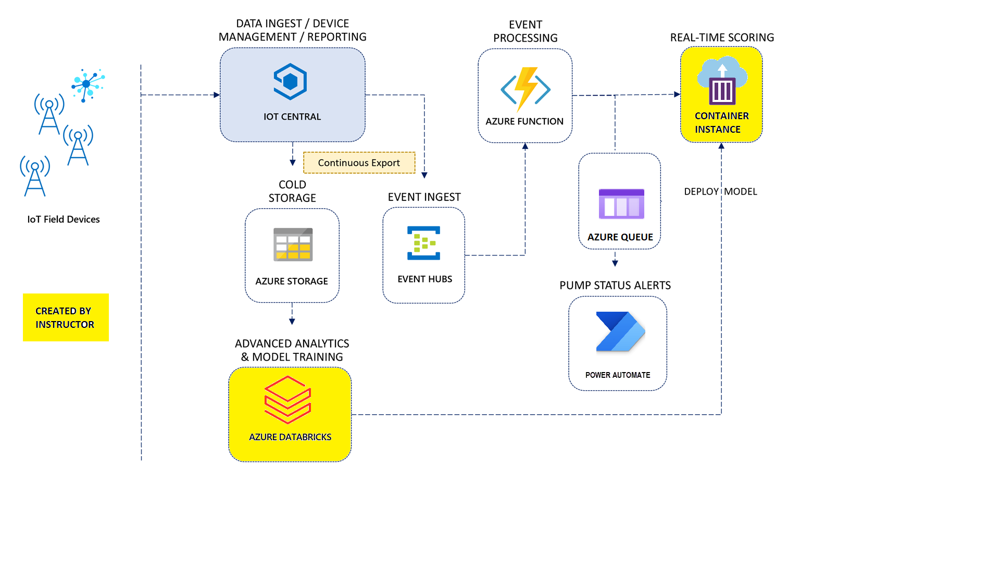

[Azure IoT Central](https://docs.microsoft.com/azure/iot-central/overview-iot-central) is at the core of the preferred solution. It is used for data ingest, device management, data storage, and reporting. IoT field devices securely connect to IoT Central through its cloud gateway. The continuous export component sends device telemetry data to [Azure Blob storage](https://docs.microsoft.com/azure/storage/blobs/storage-blobs-overview) for cold storage, and the same data to [Azure Event Hubs](https://docs.microsoft.com/azure/event-hubs/event-hubs-about) for real-time processing. Azure Databricks uses the data stored in cold storage to periodically re-train a Machine Learning (ML) model to detect oil pump failures. It is also used to deploy the trained model to a web service hosted by [Azure Kubernetes Service](https://docs.microsoft.com/azure/aks/) (AKS) or [Azure Container Instances](https://docs.microsoft.com/azure/container-instances/) (ACI), using [Azure Machine Learning](https://docs.microsoft.com/azure/machine-learning/service/overview-what-is-azure-ml). An [Azure function](https://docs.microsoft.com/azure/azure-functions/functions-overview) is triggered by events flowing through Event Hubs. It sends the event data for each pump to the web service hosting the deployed model, then sends an alert through [Microsoft Power Automate](https://flow.microsoft.com/) if an alert has not been sent within a configurable period of time. The alert is sent in the form of an email, identifying the failing oil pump with a suggestion to service the device.

_Azure IoT Central architecture_

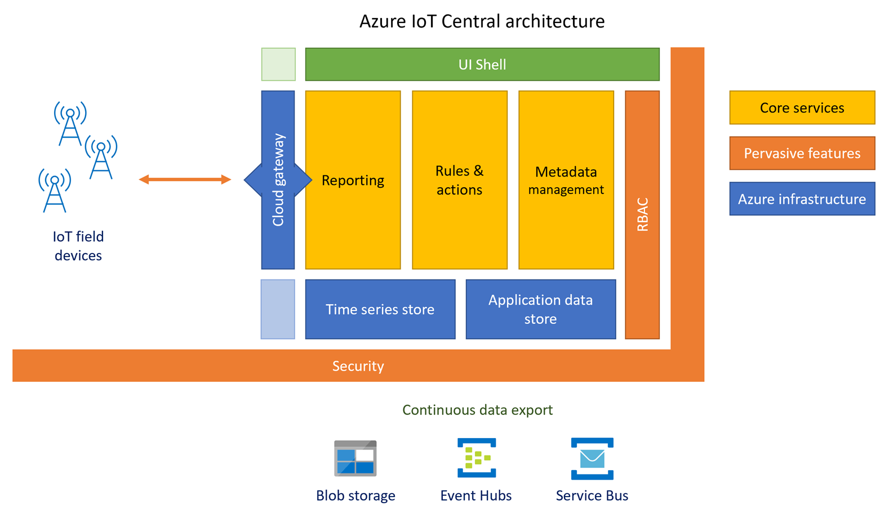

The diagram above shows the components of IoT Central's architecture that pertain to Fabrikam's use case. Because it is a SaaS-based solution, the Azure services IoT Central uses are hidden from view. IoT field devices securely connect to IoT Central through its cloud gateway. The gateway uses Azure IoT Hub Device Provisioning Service (DPS) to streamline device management, and the underlying IoT Hub service facilitates bi-directional communication between the cloud and IoT devices. All device telemetry is stored in a time series data store, based on Azure Time Series Insights. The application data store persists the IoT Central application and its customizations. This application provides a user interface shell, through which Fabrikam's users manage devices and associated metadata, view dashboards and reports, and configure rules and actions to react to device telemetry that indicates possible rod pump failure. Pervasive throughout the end-to-end solution is security in transit and at rest for devices and the web-based management application. The continuous data export feature is used to enable hot and cold path workloads on real-time and batch device telemetry and metadata, using external services. Batch data is exported to Azure Blob storage in Apache Avro file format each minute, and real-time data is exported to either Azure Event Hubs or Azure Service Bus.

## Requirements

1. Microsoft Azure subscription (non-Microsoft subscription, must be a pay-as-you subscription).
2. [.NET Core 3.1](https://dotnet.microsoft.com/download/dotnet-core/3.1)
3. [Visual Studio Code](https://code.visualstudio.com/) version 1.39 or greater
4. [C# Visual Studio Code Extension](https://marketplace.visualstudio.com/items?itemName=ms-vscode.csharp)
5. [Azure Functions Core Tools version 2.x (using NPM or Chocolatey - see readme on GitHub repository)](https://github.com/Azure/azure-functions-core-tools)
6. [Azure Functions Visual Studio Code Extension](https://marketplace.visualstudio.com/items?itemName=ms-azuretools.vscode-azurefunctions)
7. An Azure Databricks cluster running Databricks Runtime 5.1 or above.

## Before the hands-on lab

Refer to the [Before the hands-on lab setup guide](./Before%20the%20HOL%20-%20Predictive%20Maintenance%20for%20Remote%20Field%20Devices.md) manual before continuing to the lab exercises.

## Exercise 1: Configuring IoT Central with devices and metadata

Duration: 45 minutes

[Azure IoT Central](https://azure.microsoft.com/en-us/services/iot-central/) is a Software as a Service (SaaS) offering from Microsoft. The aim of this service is to provide a frictionless entry into the Cloud Computing and IoT space. The core focus of many industrial companies is not on cloud computing; therefore, they do not necessarily have the personnel skilled to provide guidance and to stand up a reliable and scalable infrastructure for an IoT solution. It is imperative for these types of companies to enter the IoT space not only for the cost savings associated with remote monitoring, but also to improve safety for their workers and the environment.

Fabrikam is one such company that could use a helping hand entering the IoT space. They have recently invested in sensor technology on their rod pumps in the field, and they are ready to implement their cloud-based IoT Solution. Their IT department is small and unfamiliar with cloud-based IoT infrastructure; their IT budget also does not afford them the luxury of hiring a team of contractors to build out a solution for them.

The Fabrikam CIO has recently heard of Azure IoT Central. This online offering will streamline the process of them getting their sensor data to the cloud, where they can monitor their equipment for failures and improve their maintenance practices and not have to worry about the underlying infrastructure. A [predictable cost model](https://azure.microsoft.com/en-us/pricing/details/iot-central/) also ensures that there are no financial surprises.

### Task 1: Model the telemetry data

The first task is to identify the data that the equipment will be sending to the cloud. This data will contain fields that represent the data read from the sensors at a specific instant in time. This data will be used in downstream systems to identify patterns that can lead to cost savings, increased safety and more efficient work processes.

The telemetry being reported by the Fabrikam rod pumps are as follows, we will be using this information later in the lab:

#### Telemetry schema

| Field          | Type     | Description                                                                                                                                                                        |
| -------------- | -------- | ---------------------------------------------------------------------------------------------------------------------------------------------------------------------------------- |
| SerialNumber   | String   | Unique serial number identifying the rod pump equipment                                                                                                                            |
| IPAddress      | String   | Current IP Address                                                                                                                                                                 |
| TimeStamp      | DateTime | Timestamp in UTC identifying the point in time the telemetry was created                                                                                                           |
| PumpRate       | Numeric  | Speed calculated over the time duration between the last two times the crank arm has passed the proximity sensor measured in Strokes Per Minute (SPM) - minimum 0.0, maximum 100.0 |
| TimePumpOn     | Numeric  | Number of minutes the pump has been on                                                                                                                                             |
| MotorPowerkW   | Numeric  | Measured in Kilowatts (kW)                                                                                                                                                         |
| MotorSpeed     | Numeric  | including slip (RPM)                                                                                                                                                               |
| CasingFriction | Numeric  | Measured in PSI (psi)                                                                                                                                                              |

### Task 2: Create an IoT Central application

1. In the Azure Portal, open the resource group you created in the **Before the HOL** exercise. From the toolbar, select the _+ Add_ button.

2. In the **Search the Marketplace**, search for and select **IoT Central application**. On the IoT Central application resource overview screen, select _Create_.

    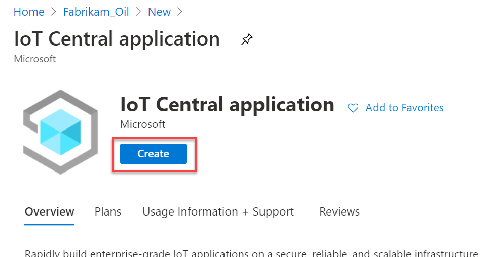

3. In the IoT Central Application, fill it out as follows, then select the _Create_ button.

    | Field          | Value     |
    | -------------- | -------- |
    | Resource name   | _enter a globally unique name_   |
    | Application URL | _keep the default_ |
    | Subscription | _select the appropriate subscription_ |
    | Resource group | _select `Fabrikam_Oil`_ |
    | Pricing plan | _select `Standard 2`_ |
    | Template | _select `Custom application`_ |
    | Location | _select the location nearest to you_ |

    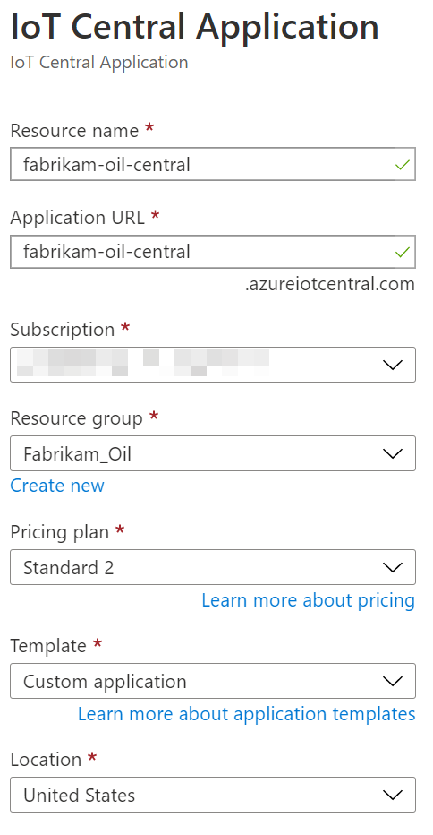

4. Wait for the application to be provisioned.

### Task 3: Create the Device Template

1. In the Azure Portal, open the `Fabrikam_Oil` resource group. Select the IoT Central Application resource from the listing.

   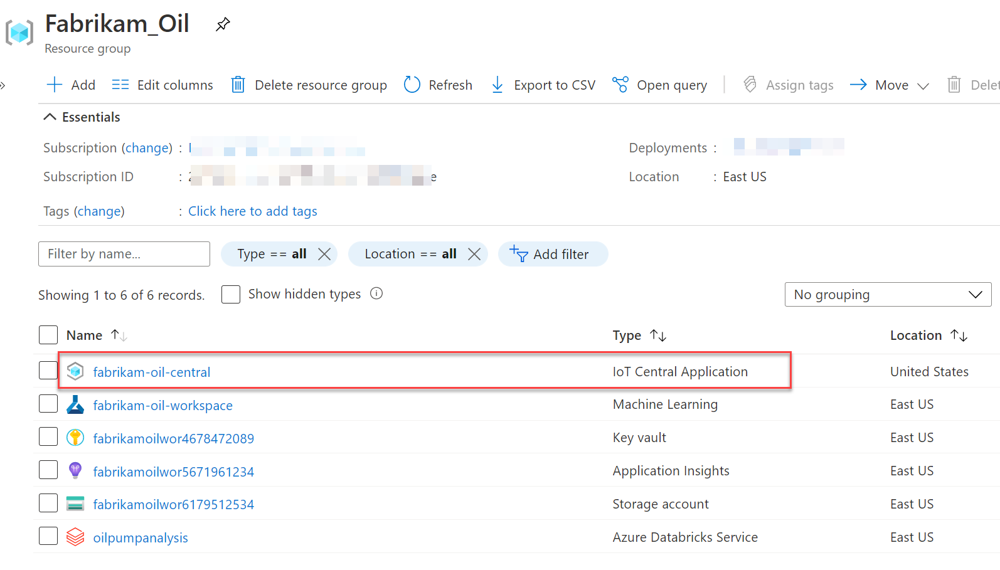

2. From the IoT Central Application Overview screen, select the _IoT Central Application URL_. This opens the IoT Central application in a new tab in your browser.

    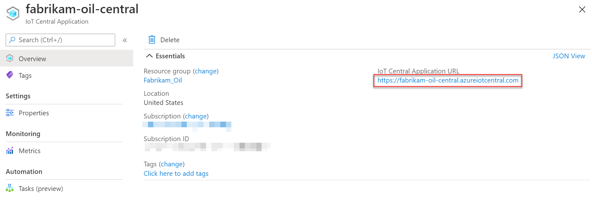

3. We need to define the type of equipment we are using, and the data associated with the equipment. In order to do this, we must define a _Device Template_. Select the _Device Templates_ menu item from the left-hand menu. Then select _+ New_ from the toolbar menu.

    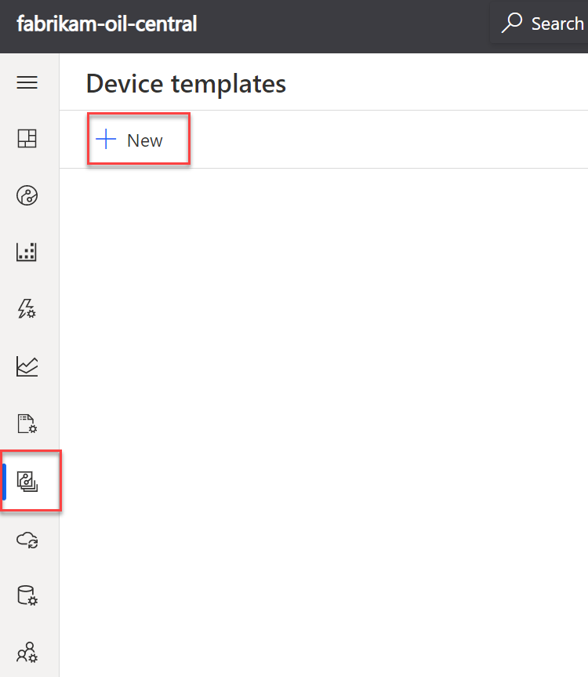

4. On the `Select type` screen, select _IoT device_ as the custom device template type. Select the _Next: Customize_ button.

    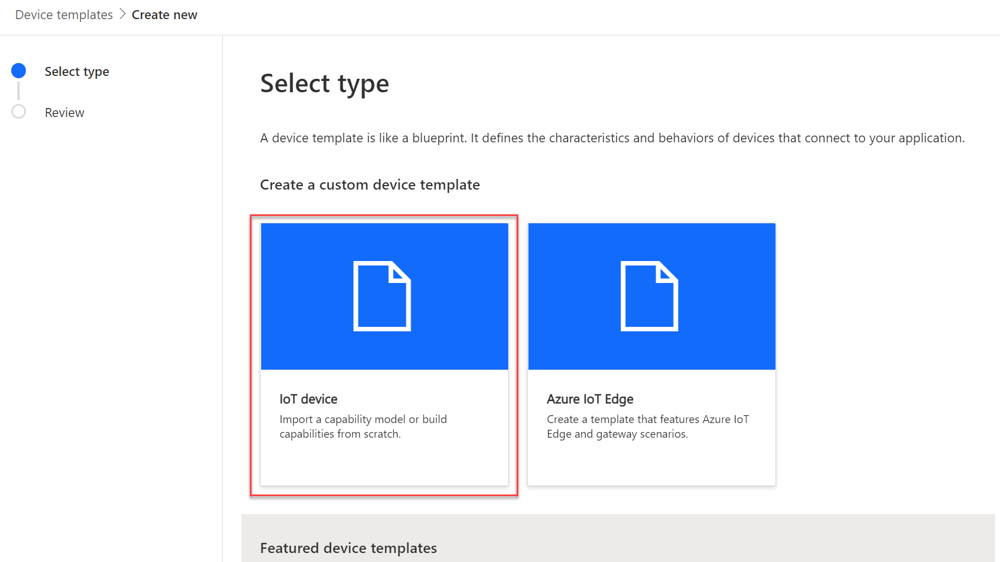

5. On the `Customize` form, for the device template name, enter _Rod Pump_. Keep the `Gateway device` checkbox unchecked. Select the _Next: Review_ button.

    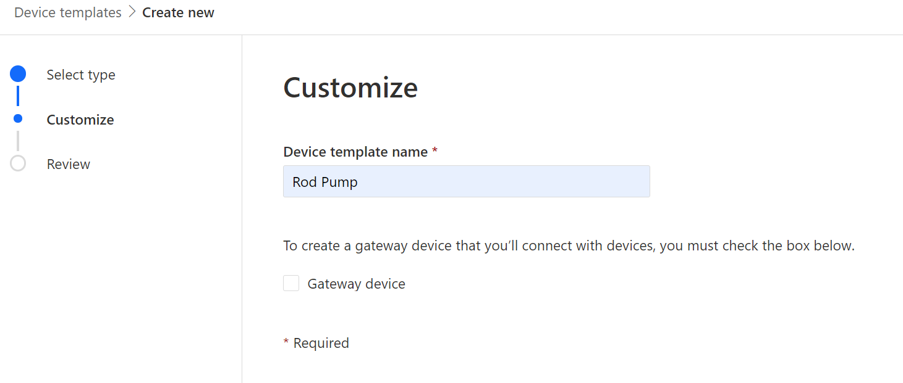

6. On the `Review` screen, select the _Create_ button.

7. On the `Rod Pump` device template screen, select _Custom model_ beneath the `Create a model` heading.

    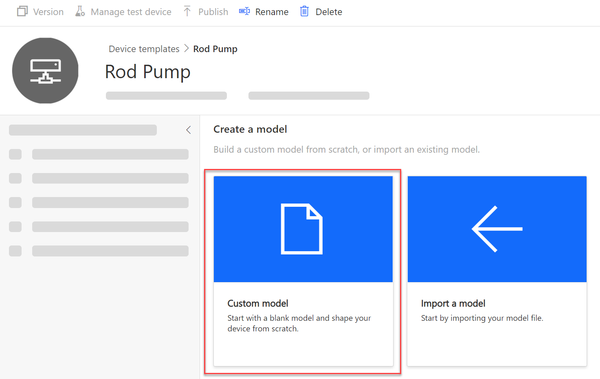

8. On the Rod Pump `Model` screen, select the `Model` parent item in the central navigation pane. Select _Add capability to default component_ from beneath the `Capabilities` heading.

    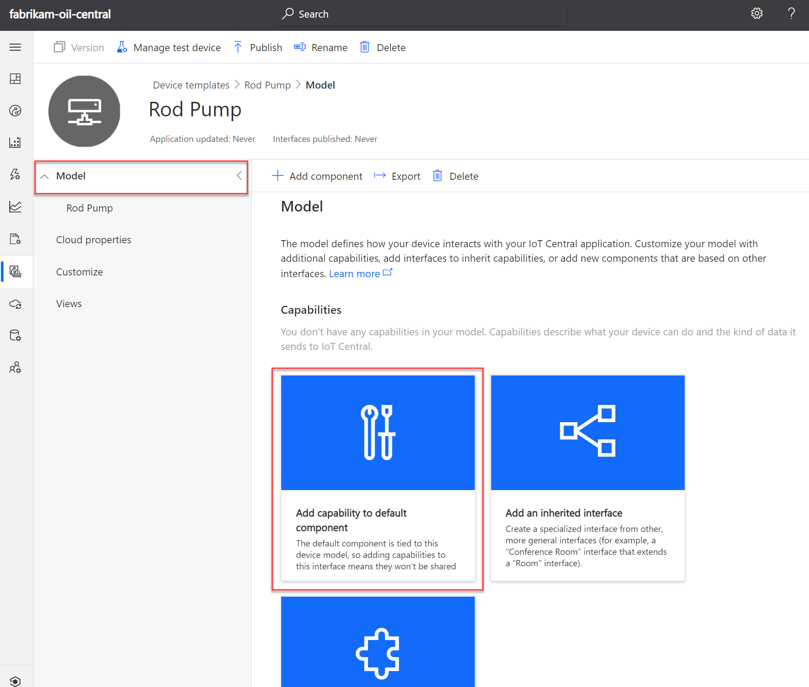

9. The `Capabilities` of the device model describe the _telemetry_ expected from the device, the _commands_ it responds to, and its _properties_ ([device twin properties](https://docs.microsoft.com/en-us/azure/iot-central/core/howto-use-properties)). We'll begin defining the `Telemetry` values, populate the capabilities as described in the following table. Use the _+ Add capability_ button at the bottom of the screen to add additional telemetry values. Select the _Save_ button from the toolbar once complete. You will need to expand the capability form to edit the Schema, Unit, Display Unit and Description fields.

    | Display Name   | Name     | Capability Type | Semantic Type | Schema | Unit   |  Display Unit | Description |
    |----------------|----------|-----------------| --------------|--------|--------|---------------|-------------|
    | Pump Rate       | PumpRate       | Telemetry | None | Double | None |  SPM     | Speed calculated over the time duration between the last two times the crank arm has passed the proximity sensor measured in Strokes Per Minute (SPM)  |
    | Time Pump On    | TimePumpOn     | Telemetry | Time Span | Double | Minute |  Minutes | Number of minutes the pump has been on |
    | Motor Power     | MotorPowerKw   | Telemetry | Power | Double | None |  kW      | Measured in Kilowatts (kW) |
    | Motor Speed     | MotorSpeed     | Telemetry | Angular Velocity | Integer | Revolution per minute |  RPM     | including slip (RPM) |
    | Casing Friction | CasingFriction | Telemetry | None | Double | None |  PSI     | strokes per minute |

    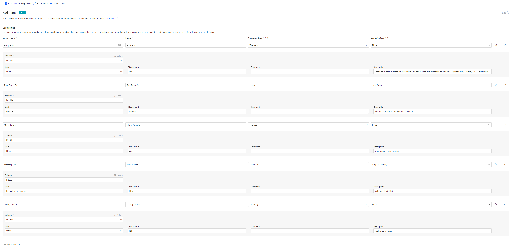

10. We also need to define the current state of the pump, whether it is running or not. Remaining on the same screen, Select _+ Add capability_. Add the state with the display name of _Power State_, field name of _PowerState_, capability type of _Telemetry_ and semantic type of _State_. For Value schema, select _String_ then add the values _Unavailable_, _On_, and _Off_ (in each the Display name, Name and Value columns). Select the _Save_ button from the toolbar menu.

    

11. In the device template, Properties are metadata associated with the equipment. For our template, we will expect a property for Serial Number, IP Address, and the geographic location of the pump. Remaining on the same screen, select _+ Add capability_. Define the device properties as follows, then select _Save_ from the toolbar menu:

    | Display Name  | Name         | Capability Type | Semantic Type | Schema | Writable | Description                       |
    | ------------- | ------------ | --------------- | ------------- | ------ |--------- | --------------------------------- |
    | Serial Number | SerialNumber | Property  | None | String      | Off |The Serial Number of the rod pump |
    | IP Address    | IPAddress    | Property  | None | String      | Off |The IP address of the rod pump    |
    | Pump Location | Location     | Property  |  Location | Geopoint  | Off | The geo. location of the rod pump |

    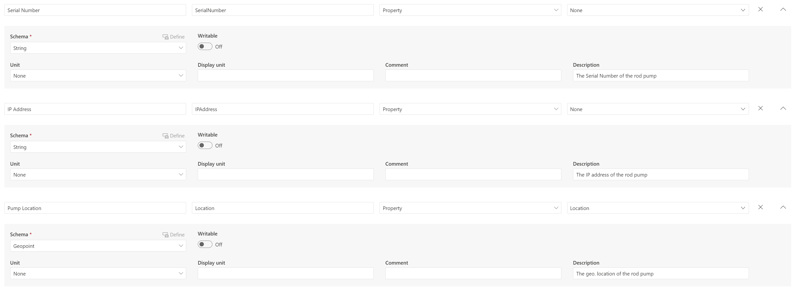

12. Operators and field workers will want to be able to turn on and off the pumps remotely. In order to do this, we will define a command. Remaining on the same screen, select _+ Add capability_. Select the _Commands_ tab and select the _New_ button to add a new command. Create a command as follows, and select _Save_ from the toolbar:

    - _Display Name_ - _Toggle Motor Power_
    - _Name_ - _ToggleMotorPower_
    - _Capability Type_ - _Command_
    - _Request_ - _On_
    - (Request) _Display name_ - _Toggle_
    - (Request) _Name_ - _Toggle_
    - (Request) _Schema_ - _Boolean_
    - _Description_ - _Toggle the motor power of the pump on and off_.

    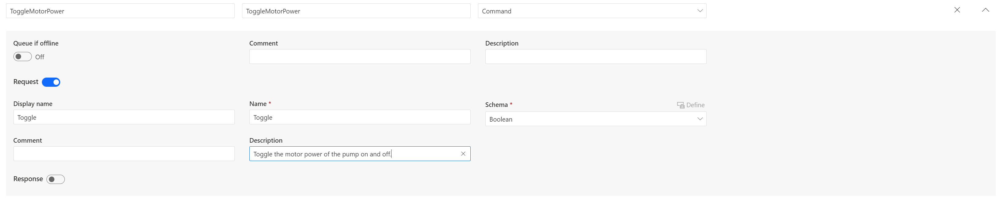
  
13. The `Rod Pump` capabilities should now look similar to the following (collapsed):

    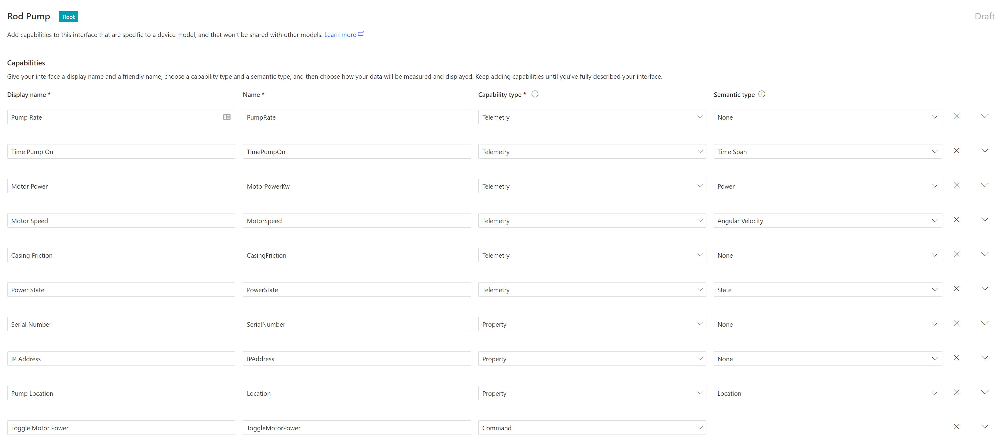

14. Now, we can define device specific views to help us visualize telemetry and state of the Rod Pumps. We can also create forms to allow pump operators to execute commands on a device. From the center pane navigation menu of the Rod Pump device template, select the _Views_ item. In the `Select to add a new view` screen, select the _Visualizing the device_ card.

    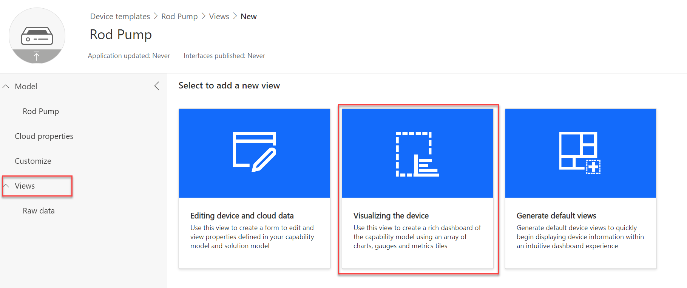

15. A View is composed of one or more tiles that display information related to a specific device. In the Create view form, set the _View name_ to _Dashboard_. Underneath _Add a tile_, select _Start with devices_. Then expand the _Telemetry_ drop down and select each item individually, then choosing the _Add tile_ button to add the chart to the View surface. Feel free to arrange the tiles as desired on the View design surface.

    

16. Remaining on the Dashboard view, expand the `Property` drop down list, and add a tile for `IP Address`, `Serial Number`, and `Pump Location`. Note that the tile for `Pump Location` renders with a map icon, meaning that IoT Central has identified the property as geography-based data, and will render it on a map appropriately.

    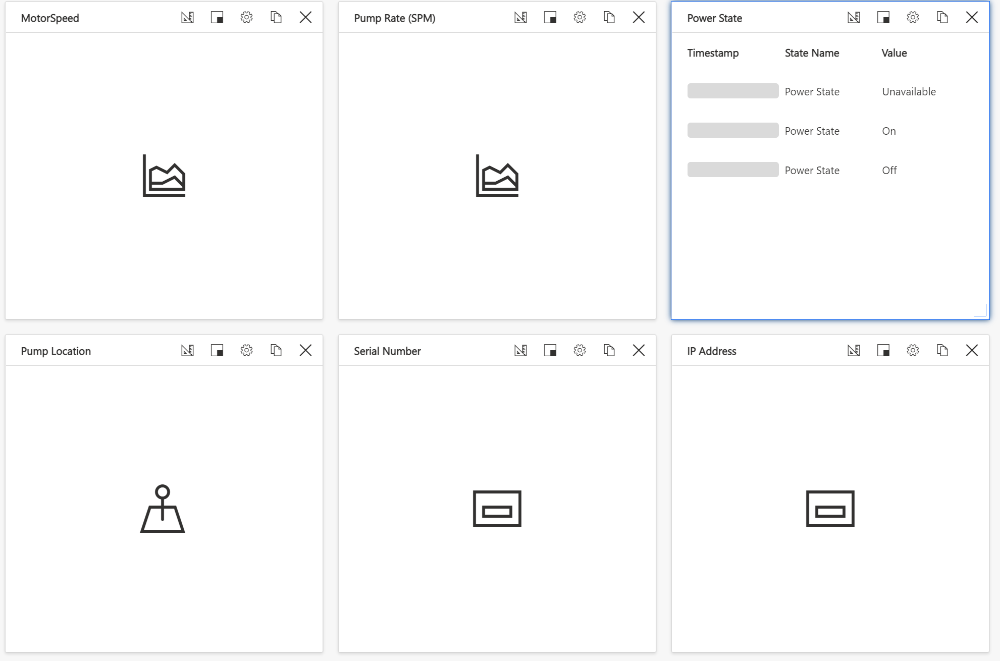

17. Spend some time now and investigate the various visualizations and settings you can set on each tile. For instance, you have the ability to customize chart types, colors and axes. You can also resize each tile individually. Select the _Save_ button in the toolbar menu to save the `Dashboard` view.

18. On the `Rod Pump` device template screen, select the `Views` item from the central navigation pane, and choose `Visualizing the device` once again to create a new view. Name this view, `Command` and add a tile for the `Toggle Motor Power` command. Once complete, press the `Save` button in the toolbar. This View will allow pump operators to initiate the toggle power command from the IoT Central application.

19. Finally, we can add a thumbnail image to represent the equipment. Select on the circle icon to left of the template name. This will allow you to select an image file. The image used in this lab can be found on [PixaBay](https://pixabay.com/photos/refinery-pump-oil-pump-industry-514010/). After setting the thumbnail, select the `Publish` button in the device template toolbar.

    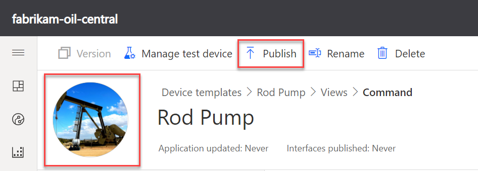

### Task 4: Create and provision real devices

Under the hood, Azure IoT Central uses the [Azure IoT Hub Device Provisioning Service (DPS)](https://docs.microsoft.com/en-us/azure/iot-dps/about-iot-dps). The aim of DPS is to provide a consistent way to connect devices to the Azure Cloud. Devices can utilize Shared Access Signatures, or X.509 certificates to securely connect to IoT Central.

[Multiple options](https://docs.microsoft.com/en-us/azure/iot-central/core/concepts-get-connected) exist to register devices in IoT Central, ranging from individual device registration to [bulk device registration](https://docs.microsoft.com/en-us/azure/iot-central/core/howto-manage-devices#import-devices) via a comma delimited file. In this lab we will register a single device using SAS.

1. In the left-hand menu of your IoT Central application, select _Devices_. Select the _Rod Pump_ template from the `Devices` blade and select the _+ New_ button from the toolbar to add a new device.

    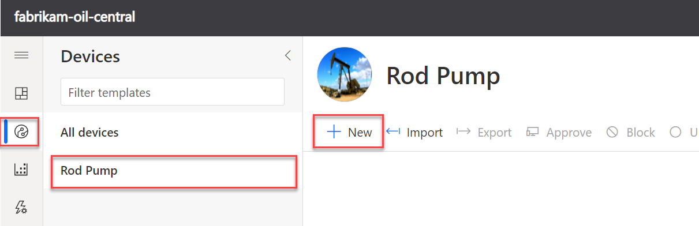

2. A modal window will be displayed with an automatically generated Device ID and Device Name. You are able to overwrite these values with anything that makes sense in your downstream systems. We will be creating three real devices in this lab. Create the following as real devices, ensure `Simulate this device` remains toggled off:

    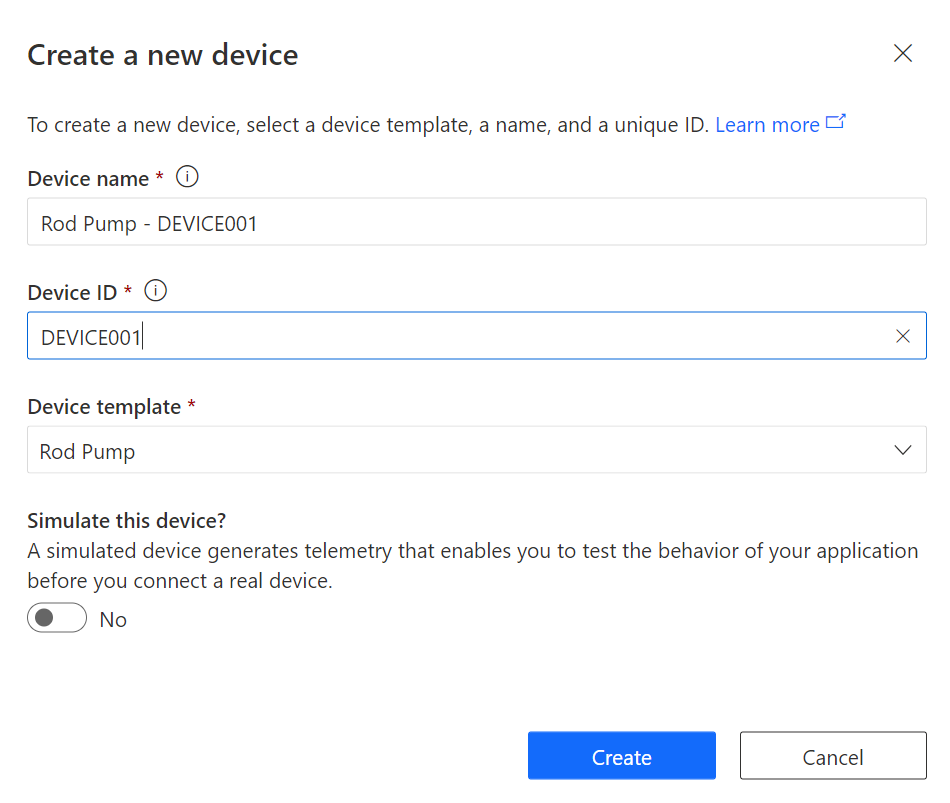

    | Device Name          | Device ID |
    | -------------------- | --------- |
    | Rod Pump - DEVICE001 | DEVICE001 |
    | Rod Pump - DEVICE002 | DEVICE002 |
    | Rod Pump - DEVICE003 | DEVICE003 |

3. On the Devices list, notice how all three real devices have the provisioning status of _Registered_.

    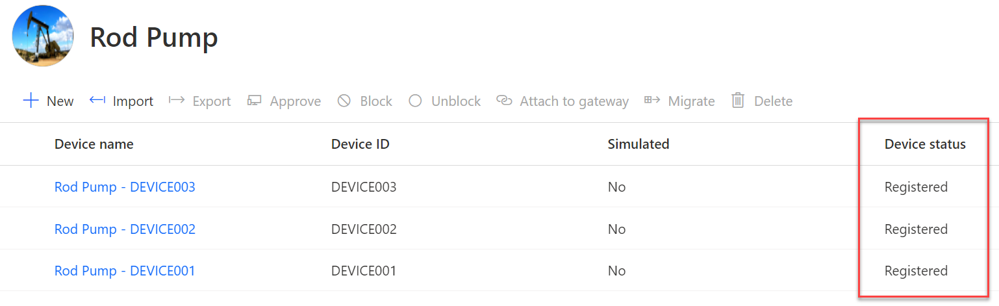

## Exercise 2: Run the Rod Pump Simulator

Duration: 30 minutes

Included with this lab is source code that will simulate the connection and telemetry of three real pumps. In the previous exercise, we have defined them as DEVICE001, DEVICE002, and DEVICE003. The purpose of the simulator is to demonstrate real-world scenarios that include a normal healthy rod pump (DEVICE002), a gradually failing pump (DEVICE001), and an immediately failing pump (DEVICE003).

### Task 1: Record device connection information

1. In IoT Central, select _Devices_ from the left-hand menu. Then, from the devices list, select the link for _Rod Pump - DEVICE001_, and select the _Connect_ button located in the upper right corner of the device's page.

    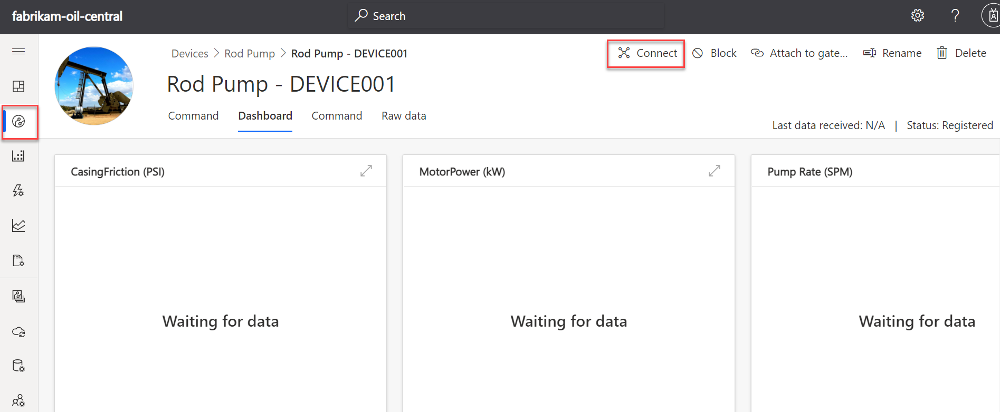

2. A Device connection modal is displayed, make note of the ID Scope, Device ID, as well as the primary key value.

    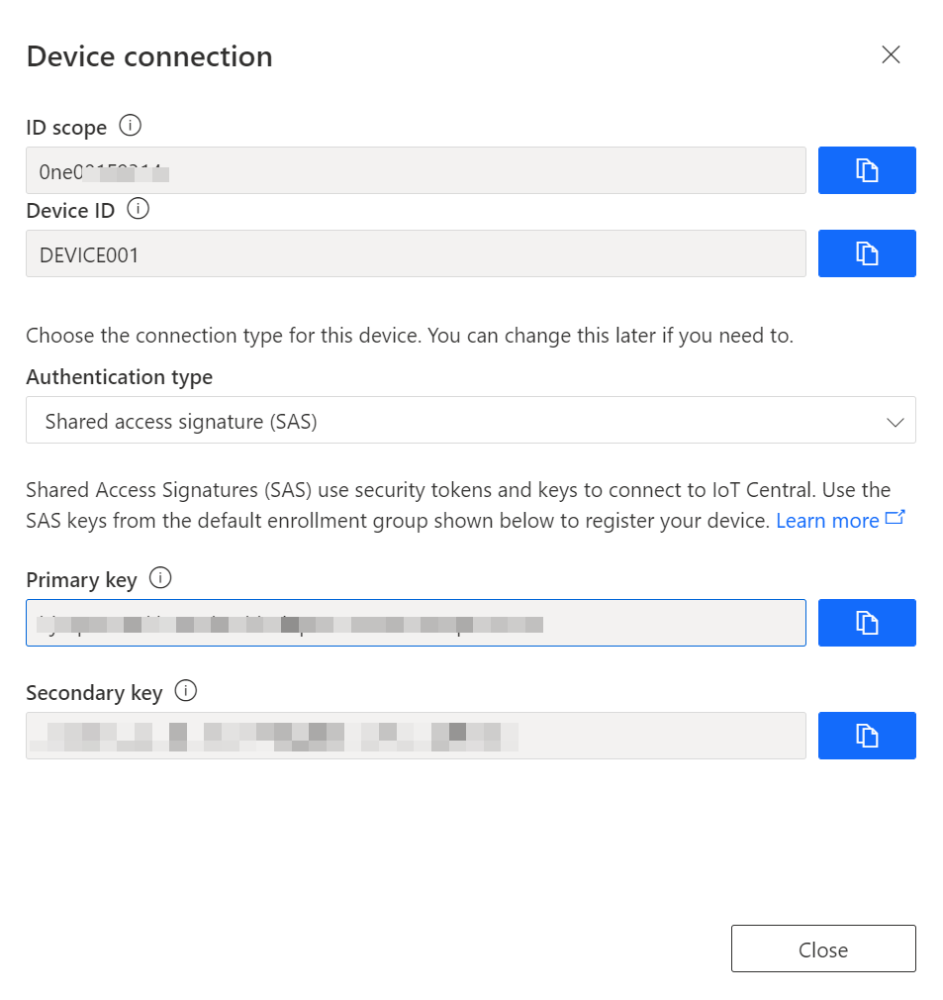

3. Repeat steps 1 and 2 for DEVICE002 and DEVICE003.

### Task 2: Open the Visual Studio solution, and update connection string values

1. Using Visual Studio Code, open the `C:\MCW-Predictive-Maintenance-for-remote-field-devices-master\Hands-on lab\Resources\FieldDeviceSimulator\Fabrikam.FieldDevice.Generator` folder.

    > If you are prompted by Visual Studio code to install additional components to enable debugging, please select the option to install the components.

2. Open the _appsettings.json_ file, and copy & paste the ID Scope and Device Primary Key values into the file.

    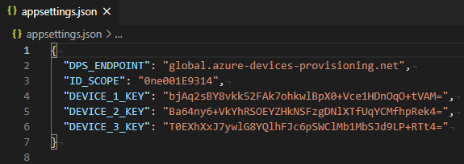

3. Open _Program.cs_, go to line 144 and you will find the _SetupDeviceRunTasks_ method. This method is responsible for creating the source code representations of the devices that we have defined earlier in the lab. Each device is initialized based on the values obtained from configuration (appsettings.json). Note that DEVICE001 is defined as the pump that will gradually fail, DEVICE002 as a healthy pump, and DEVICE003 as a pump that will fail immediately after a specific amount of time. Line 167 also adds an event handler that gets fired every time the Power State for a pump changes. The power state of a pump gets changed via a cloud to device command - we will be visiting this concept later on in this lab.

4. Open _PumpDevice.cs_, this class represents a device in the field. It encapsulates the properties (serial number and IP address) that are expected in the properties for the device in the cloud. It also maintains its own power state. Line 73 shows the _RegisterAndConnectDeviceAsync_ method that is responsible for connecting to the global device provisioning endpoint to obtain the underlying IoT Hub connection information for the device to establish a connection to the IoT Central application (through the DeviceClient). Line 110 shows the _SendDevicePropertiesAndInitialState_ method which updates the reported properties from the device to the cloud. This is also referred to as _Device Twins_. Line 154 shows the _SendEvent_ method that sends the generated telemetry data to the cloud.

### Task 3: Run the application

1. Within Visual Studio Code, expand the **.vscode** sub-folder, then open **launch.json**. Update the `console` setting to **externalTerminal**. This will cause the debugger to launch the console window into an external terminal instead of within Visual Studio Code. This is a required step since the internal terminal does not support entering values (ReadLine).

    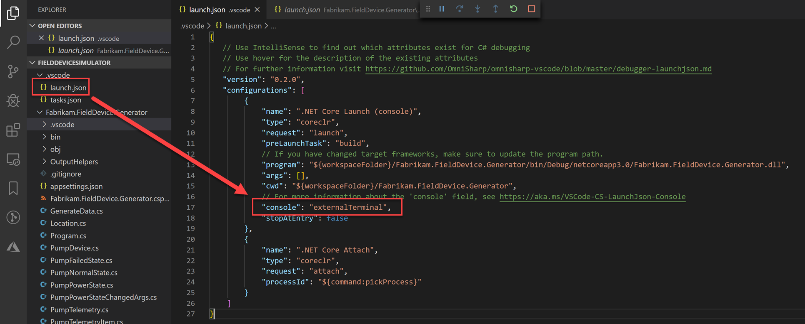

2. Using Visual Studio Code, Debug the current project by pressing _F5_.

3. Once the menu is displayed, select option 1 to generate and send telemetry to IoT Central.

    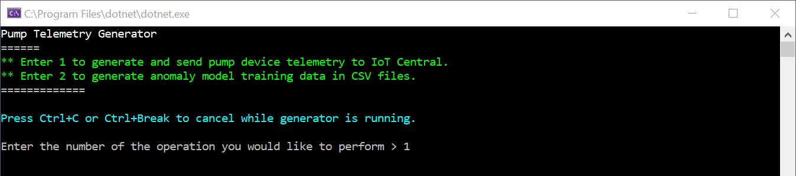

4. Allow the simulator to start sending telemetry data to IoT Central, you will see output similar to the following:

    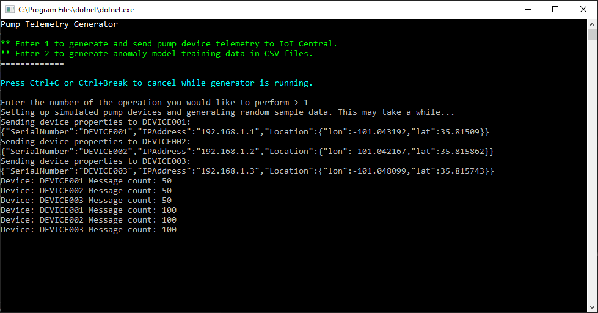

5. Allow the simulator to run while continuing with this lab.

6. After some time has passed, in IoT Central select the _Devices_ item in the left-hand menu. Note that the provisioning status of DEVICE001, DEVICE002, and DEVICE003 now indicate _Provisioned_.

    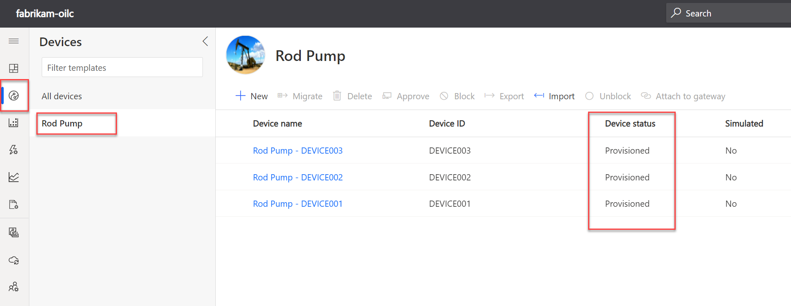

### Task 4: Interpret telemetry data

DEVICE001 is the rod pump that will gradually fail. Upon running the simulator for approximately 10 minutes (or 1100 messages), you can take a look at the Motor Power chart in the Device Dashboard, or on the measurements tab and watch the power consumption decrease.

1. In IoT Central, select the _Devices_ menu item, then select the link for _Rod Pump - DEVICE001_ in the Devices list.

2. Ensure the _Dashboard_ tab is selected and observe how the Motor Power usage of DEVICE001 gradually degrades.  **Note**: You may not yet see the degradation at this stage. The motor power will gradually decrease after running for several minutes.

    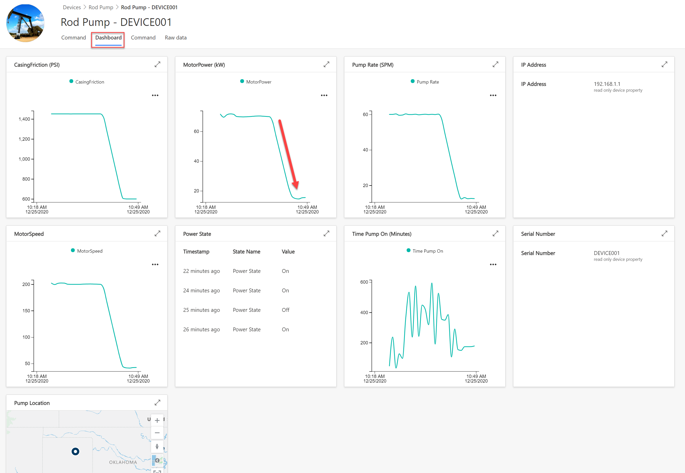

3. Repeat 1-3 and observe that DEVICE002, the non-failing pump, remains above the 30 kW threshold. DEVICE003 is also a failing pump but displays an immediate failure versus a gradual one.

    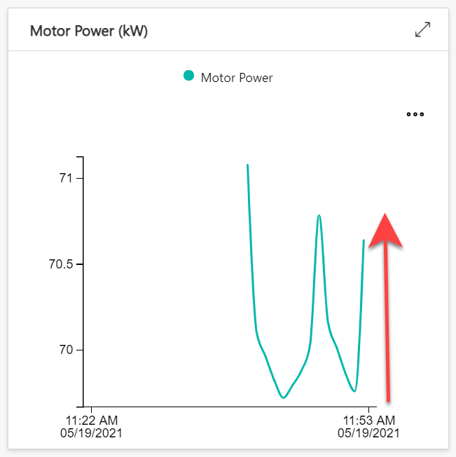

    

### Task 5: Restart a failing pump remotely

After observing the failure of two of the rod pumps, you are able cycle the power state of the pump remotely. The simulator is setup to receive the Toggle Motor Power command from IoT Central and will update the state accordingly and start/stop sending telemetry to the cloud.

1. In IoT Central, select _Devices_ from the left-hand menu, then select _Rod Pump - DEVICE001_ from the device list. Observe that even though the pump has in all purposes failed, that there is still power to the motor. In order to recover DEVICE001, select the _Command_ tab. You will see the _Toggle Motor Power_ command with a Toggle parameter. Set the _Toggle_ parameter to `False`, then select the _Run_ button on the command to turn the pump motor off.

    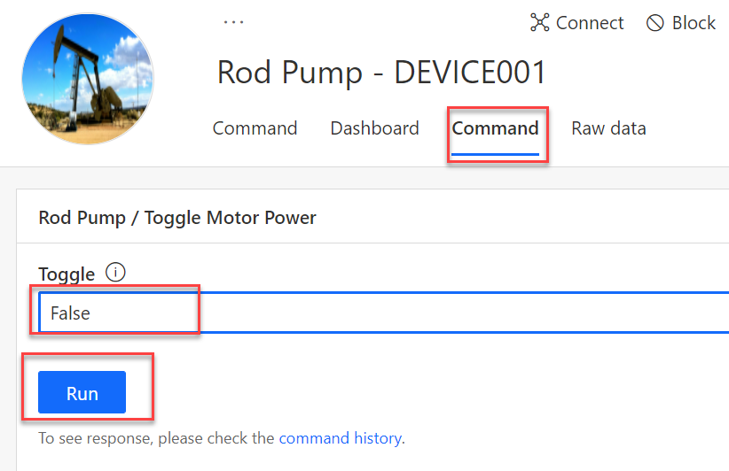

2. The simulator will also indicate that the command has been received from the cloud. Note in the output of the simulator, that DEVICE001 is no longer sending telemetry due to the pump motor being off.

    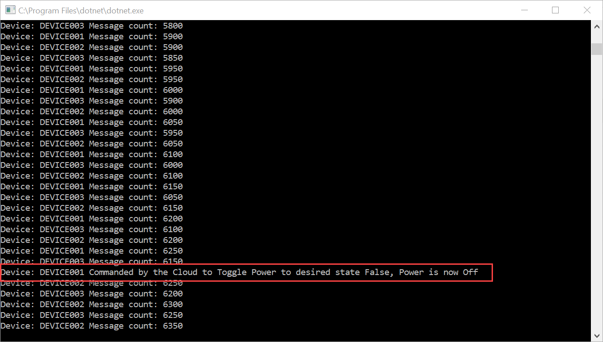

3. After a few moments, return to the _Dashboard_ tab of _DEVICE001_ in IoT Central. Note the receipt of telemetry has stopped, and the state indicates the motor power state is off.

    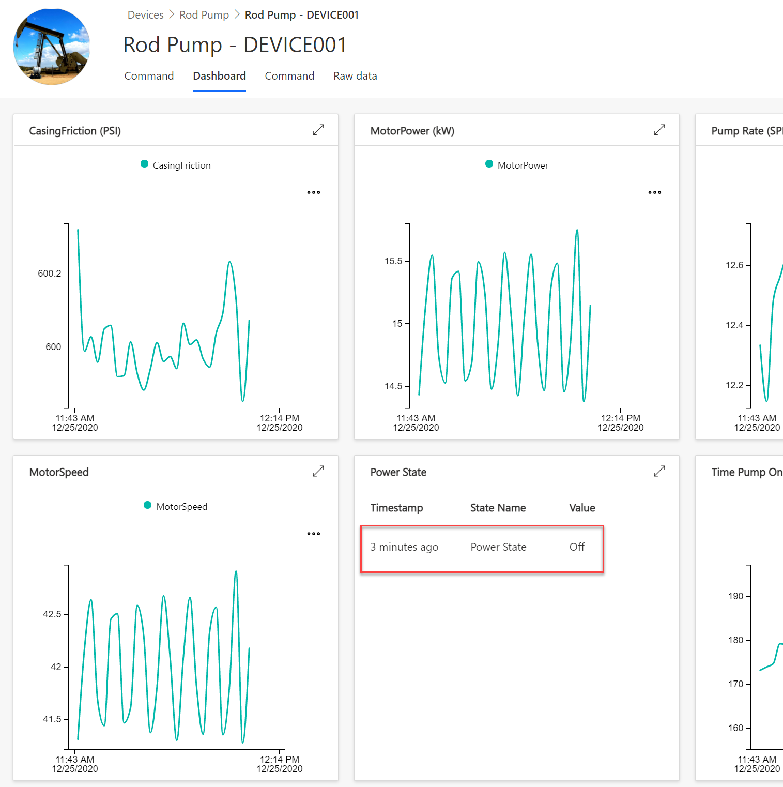

4. Return to the _Commands_ tab and toggle the motor power back on again by selecting `True` and pressing the _Run_ button once more. On the _Dashboard_ tab, you will see the Power State switch back to online, and telemetry to start flowing again. Due to the restart of the rod pump - it has now recovered, and telemetry is back into normal ranges!

    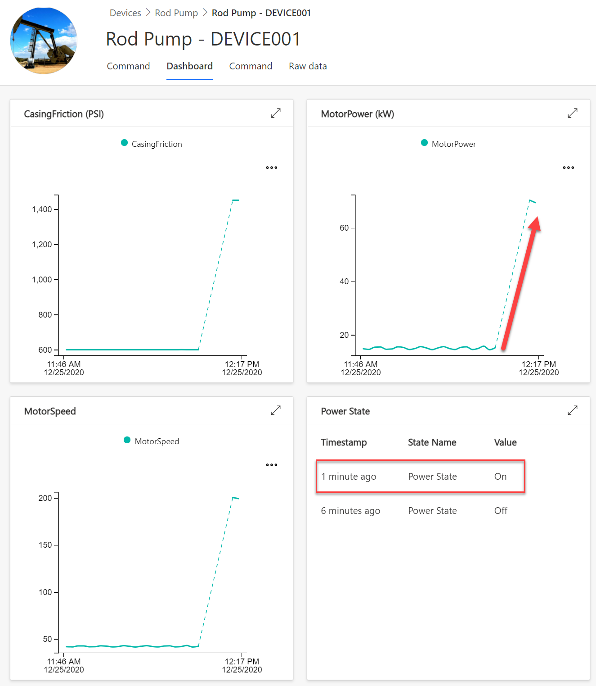

## Exercise 3: Creating a device group

Duration: 10 minutes

Device groups allow you to create logical groupings of IoT Devices in the field by the properties that defined them. In this case, we will want to create a device set that contains only the rod pumps located in the state of Texas.

### Task 1: Create a device group using a filter

1. In the left-hand menu, select the _Device groups_ menu item. You will see a single default device group in the list (_Rod Pump - All devices_). Select the _+ New_ button in toolbar.

    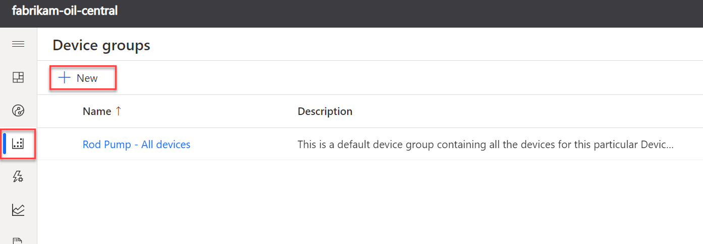

2. In the field, all Texas pumps are located in the *192.168.1.* subnet, so we will create a filter to include only those pumps in this device group. Create the Device group with the filter as described in the following table. Feel free to _Run query_ to see the devices included, then select _Save_ from the toolbar:

    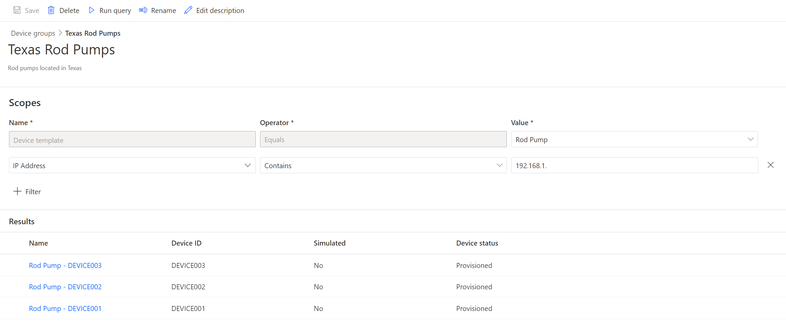

    | Field               | Value                      |
    | ------------------- | -------------------------- |
    | Device Group Name (in header) | Texas Rod Pumps            |
    | Description (in header)       | Rod pumps located in Texas |
    | Scope Device Template     | Rod Pump           |
    | Filter: Property | IP Address                 |
    | Filter: Operator | contains                   |
    | Filter: Value    | 192.168.1.                 |

3. Once the Device group is saved, you are able to act upon this group of devices as a single unit within IoT Central.

## Exercise 4: Creating a useful dashboard

Duration: 30 minutes

One of the main features of IoT Central is the ability to visualize the health of your IoT system at a glance. Creating a customized dashboard that best fits your business is instrumental in improving business processes. In this exercise, we will go over adding a main dashboard that will be displayed upon entry to the IoT Central application.

### Task 1: Clearing out the default dashboard

1. In the left-hand menu, select the _Dashboard_ item. Then, select the _Edit_ button.

    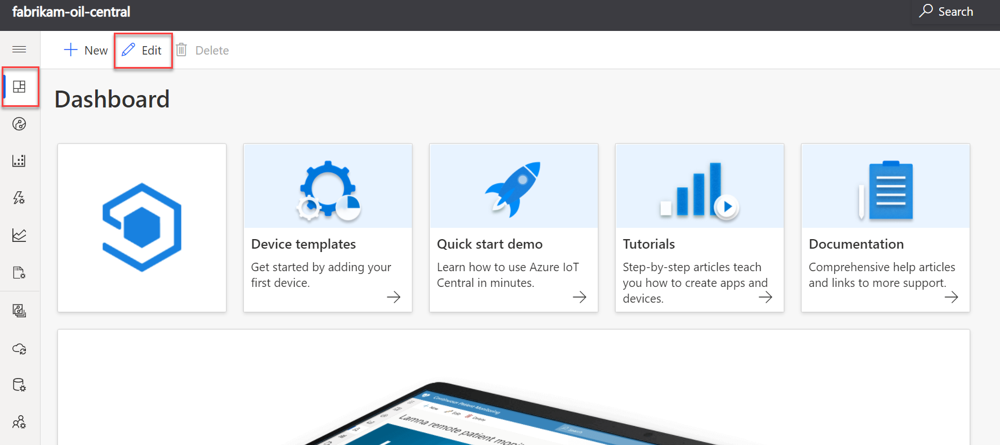

2. Expand the ellipsis menu on each tile that you do not wish to see on the dashboard and select _Delete_ to remove them. Some tiles are deleted by selecting the _X_ button on the tile.

    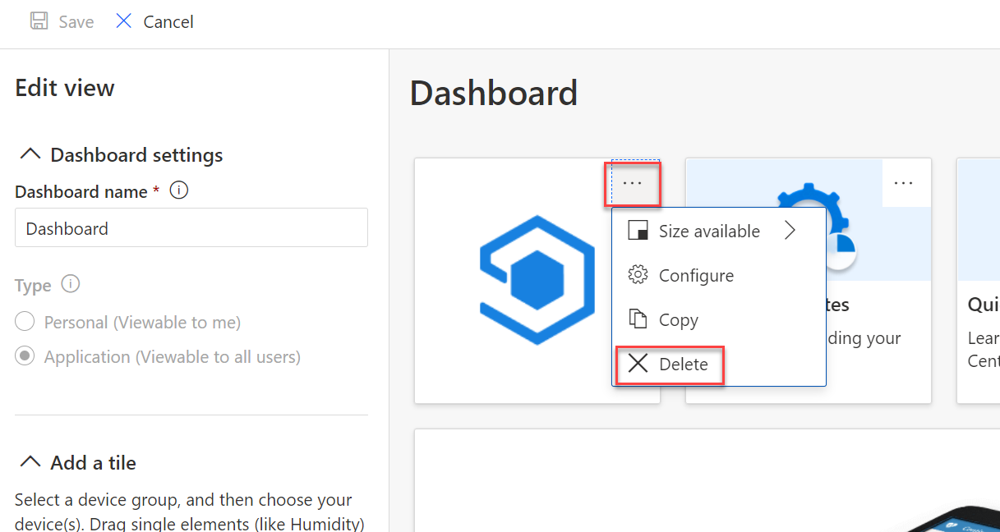

### Task 2: Add your company logo

1. Remaining in the edit mode of the dashboard, select _Image (static)_ from the _Add a tile_ section of the menu. Select _Add tile_.

    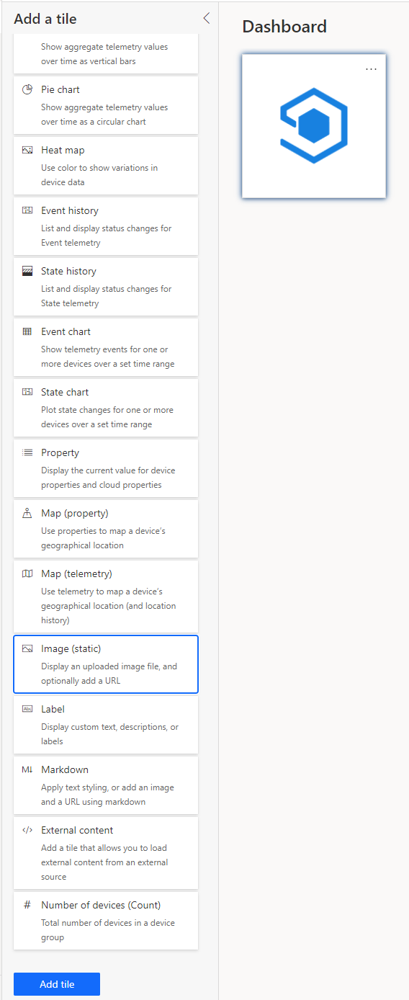

2. Once the tile is added to the design surface, expand the ellipsis menu on the tile, and select _Configure_. Configure the logo with the following file _C:\MCW-Predictive-Maintenance-for-remote-field-devices-master\Hands-on lab\media\fabrikam-logo.png_. Select the _Update_ button once complete.

    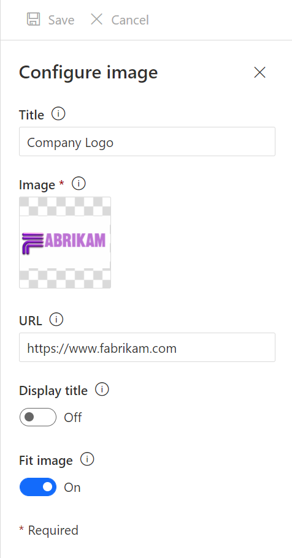

3. Resize the logo on the dashboard using the handle on the lower right of the logo tile.

    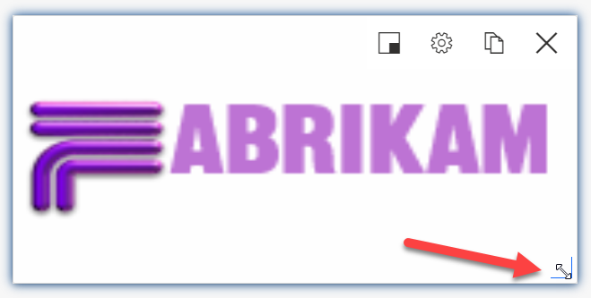

### Task 3: Add a list of Texas Rod Pumps

In the previous exercise, we created a device group that contains the devices located in Texas. We will leverage this device set to display this filtered information.

1. Remaining in the edit mode of the dashboard, select _Start with devices_ from the _Add a tile_ section of the menu.

2. Select _Texas Rod Pumps_ from the _Device group_ dropdown, then select each of the devices in the _Devices_ list.

3. In the _Property_ section, select the _Serial Number_, and _IP Address_ properties. Add properties by selecting the _+ Property_ button. Once complete, select the _Add tile_ button.

    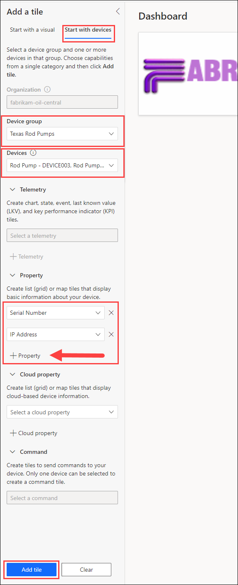

    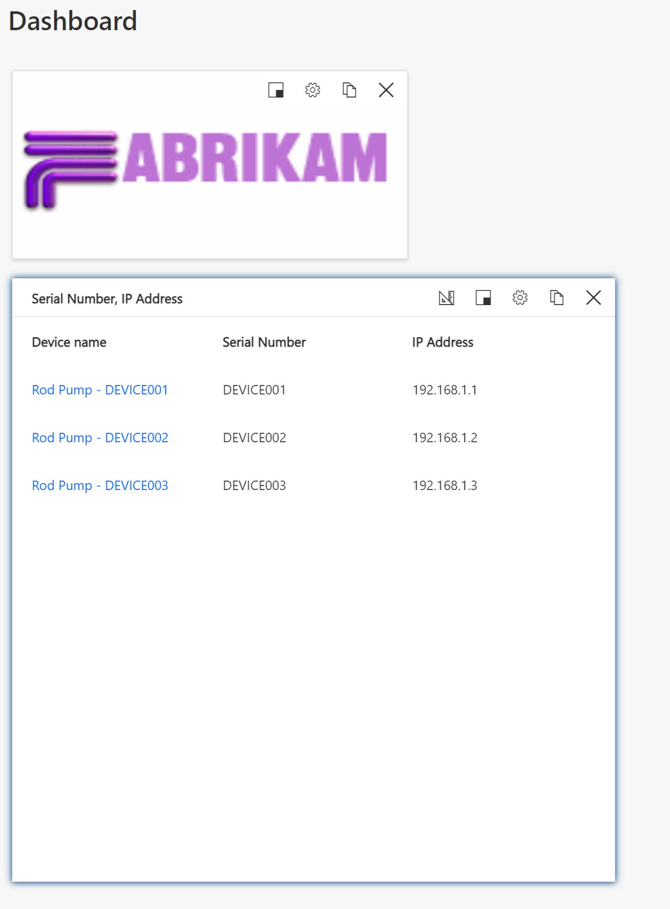

### Task 4: Add a map displaying the locations of the Texas Rod Pumps

It is beneficial to see the location of certain critical Texas rod pumps. We will add a map that will display the location of each of the Texas Rod Pump devices.

1. Return to the _Edit_ view of the Dashboard. Select _Start with a visual_ from the _Add a tile_ section of the menu.  Select _Map (property)_. Select _Add tile_.

     tile")

2.  Once the tile is added to the design surface, expand the ellipsis menu on the tile, and select _Configure_.  Configure the map with the following settings, then click _Update_ to save the configuration changes.

   | Field          | Value                                 |
   | -------------- | ------------------------------------- |
   | Title          | Pump Location                         |
   | Device Group   | Texas Rod Pumps                       |
   | Devices        | _select each device_                  |
   | Property       | Pump Location                         |
   
    tile")

3. Observe how the device group now has a map displaying markers for each device in the set. Feel free to adjust to zoom to better infer their location.

    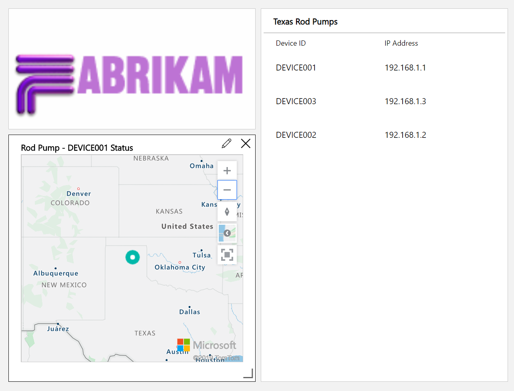

4. Return to the edit view of the Dashboard and experiment adding additional visualizations relative to the Texas Rod Pump device group. For instance, add a Line chart tile that shows the Motor Power data for all of the devices in a single chart.

    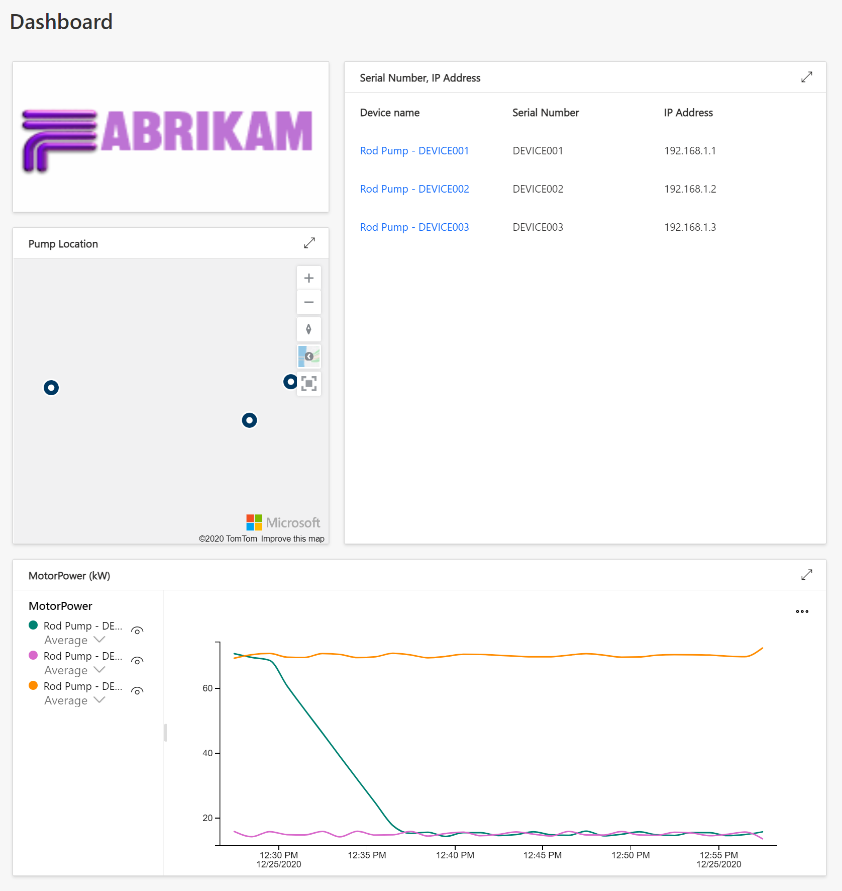

## Exercise 5: Create an Event Hub and continuously export data from IoT Central

Duration: 15 minutes

IoT Central provides a great first stepping stone into a larger IoT solution. A more mature IoT solution typically involves a machine learning model that will process incoming telemetry to logically determine if a failure of a pump is imminent. The first step into this implementation is to create an Event Hub to act as a destination for IoT Central's continuously exported data.

### Task 1: Create an Event Hub

The Event Hub we will be creating will act as a collector for data coming into IoT Central. The receipt of a message into this hub will ultimately serve as a trigger to send data into a machine learning model to determine if a pump is in a failing state. We will also create a Consumer Group on the event hub to serve as an input to an Azure Function that will be created later on in this lab.

1. Log into the [Azure Portal](https://portal.azure.com), and open your **Fabrikam_Oil** resource group.

2. On the top of the screen, select the **Add** button. When the marketplace screen displays, search for and select **Event Hubs**. This will allow you to create a new Event Hub Namespace resource. Select the _Create_ button on the resource overview screen.

    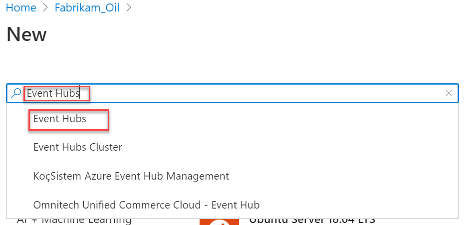

3. Configure the event hub as follows, select the *Review + create** button, and then **Create**:

   | Field          | Value                                 |
   | -------------- | ------------------------------------- |
   | Subscription   | _select the appropriate subscription_ |
   | Resource Group | Fabrikam_Oil                          |
   | Name           | _anything (must be globally unique)_  |
   | Location       | _select the location nearest to you_  |
   | Pricing Tier   | Standard                              |

   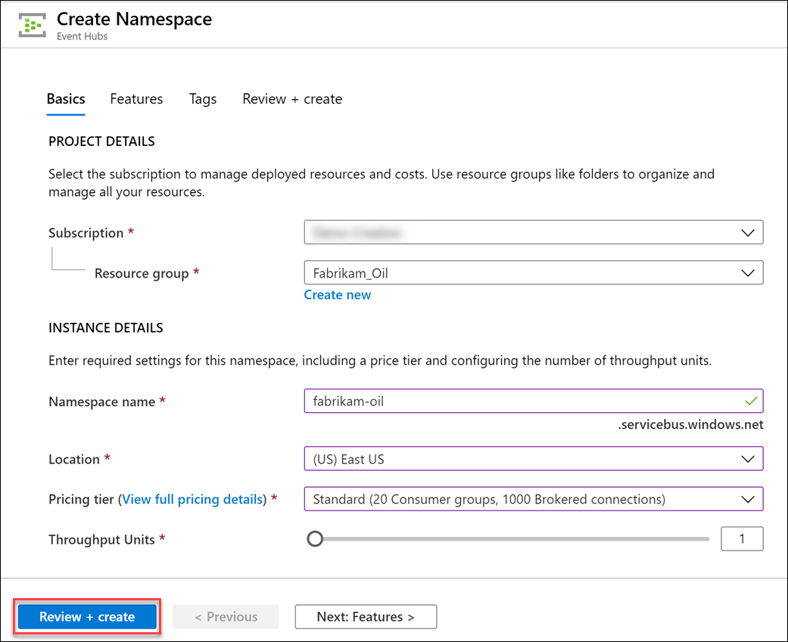

4. Once the Event Hubs namespace has been created, open it and select the **+ Event Hub** button at the top of the screen.

   

5. In the Create Event Hub form, configure the hub as follows and select the **Create** button:

   | Field        | Value            |
   | ------------ | ---------------- |
   | Name         | iot-central-feed |
   | Partition Count | 2                |
   | Message Retention | 1                |
   | Capture      | Off              |

   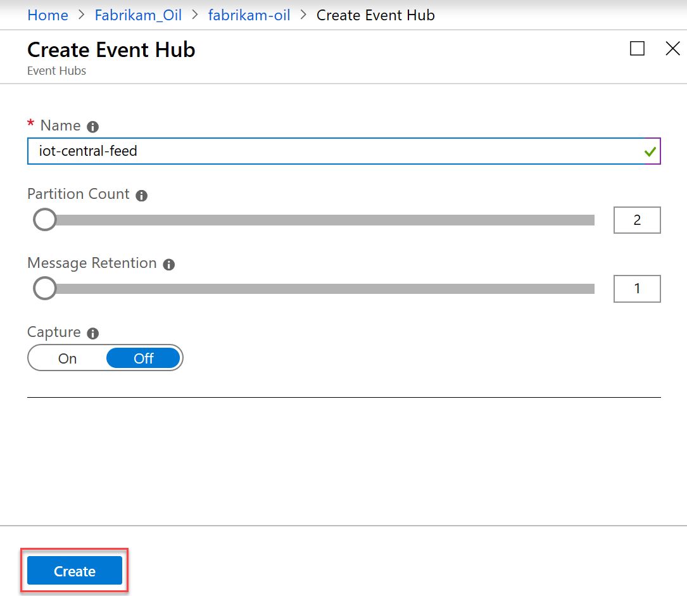

6. Once the Event Hub has been created, open it by selecting _Event Hubs_ in the left-hand menu, and selecting the hub from the list.

   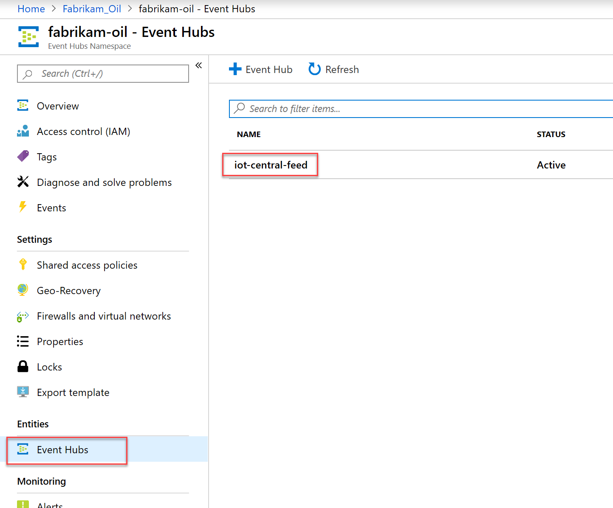

7. From the top menu, select the **+ Consumer Group** button to create a new consumer group for the hub. Name the consumer group _ingressprocessing_ and select the **Create** button.

   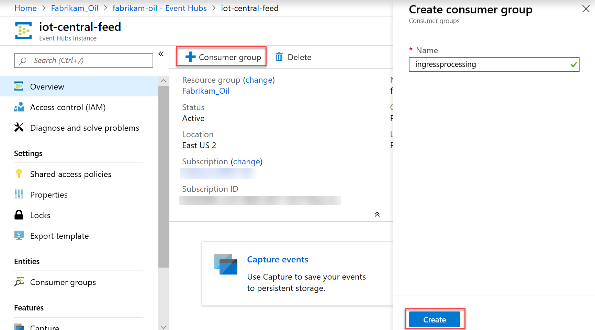

### Task 2: Configure continuous data export from IoT Central

1. Return to the IoT Central application, from the left-hand menu, select **Data export**. Then select the **+ New** button from the toolbar menu.

   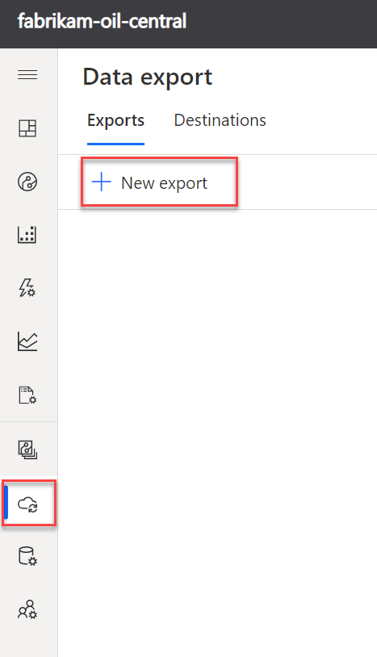

2. Begin configuring the data export with the following values:

   | Field                | Value                                            |
   | -------------------- | ------------------------------------------------ |
   | Display Name  (Header)        | Event Hub Feed                                   |
   | Enabled (Header)              | On                                               |
   | Type of data to export | Telemetry |
  
3. In the _Destinations_ section, select the _create a new one_ link. Configure the new destination as follows, then select the _Create_ button:

    | Field                | Value                                            |
    | -------------------- | ------------------------------------------------ |
    | Destination name     | iot-central-event-hub-feed                                   |
    | Destination type              | Azure Event Hubs                                               |
    | Connection string | see subsection below on how to get the connection string |
    | Event Hub | iot-central-feed |

   Obtain the connection string as follows:

   - Navigate to your Event Hubs namespace in the Azure portal.

   - Select **Shared access policies** on the left-hand menu, then select the **RootManageSharedAccessKey** and copy the **Connection string-primary key**.

        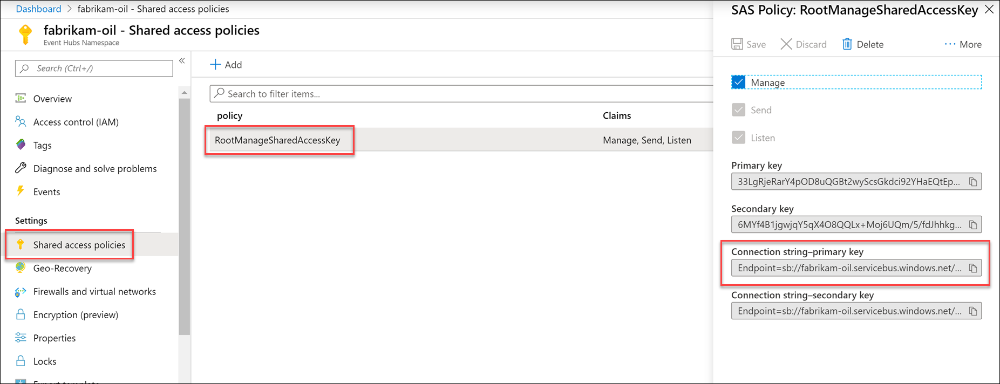

   - Return to IoT Central and paste the connection string into the **Connection string** field, then select the `iot-central-feed` event hub you created.

   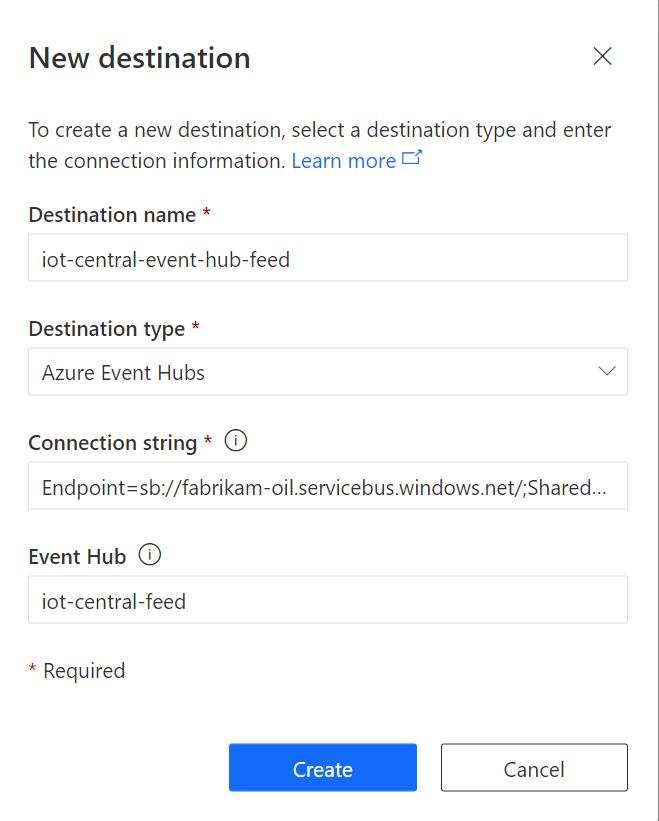

   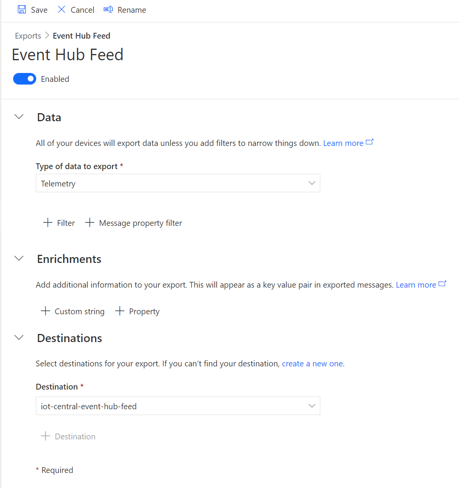

4. Select the _Save_ button from the toolbar menu on the _Event Hub Feed_ continuous export screen.

5. The Event Hub Feed export will be created, and then started (it may take a few minutes for the export to start). Return to the Data export list to see the current status of the feed.

   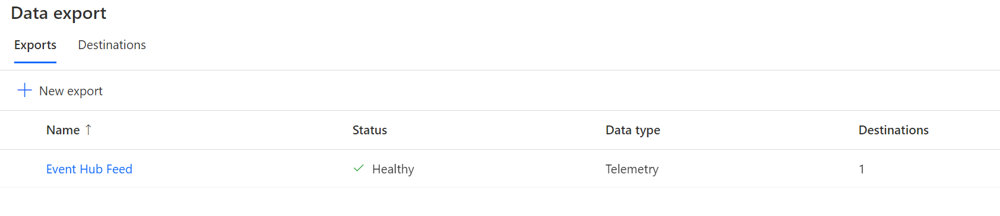

## Exercise 6: Use Azure Databricks and Azure Machine Learning service to train and deploy predictive model

Duration: 15 minutes

In this exercise, we will use Azure Databricks to train a deep learning model for anomaly detection by training it to recognize normal operating conditions of a pump. We use three data sets for training: A set of telemetry generated by a pump operating under normal conditions, a pump that suffers from a gradual failure, and a pump that immediately fails.

After training the model, we validate it, then register the model in your Azure Machine Learning service workspace. Finally, we deploy the model in a web service hosted by Azure Container Instances for real-time scoring from the Azure function.

### Task 1: Run the Anomaly Detection notebook

1. In the [Azure portal](https://portal.azure.com), open your lab resource group, then open your **Azure Databricks Service**.

2. Select **Launch Workspace**. Azure Databricks will automatically sign you in through its Azure Active Directory integration.

   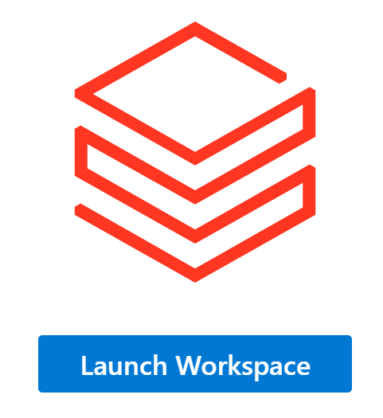

3. In Azure Databricks, select **Workspace**, select **Users**, then select your username.

4. Select the `Anomaly Detection` notebook to open it.

   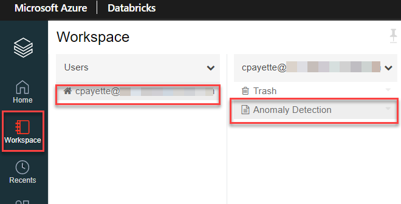

5. Before you can execute the cells in this notebook, you must first attach your Databricks cluster. Expand the dropdown at the top of the notebook where you see **Detached**. Select your lab cluster to attach it to the notebook. If it is not currently running, you will see an option to start the cluster.

   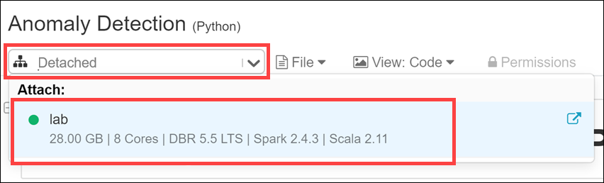

6. You may use keyboard shortcuts to execute the cells, such as **Ctrl+Enter** to execute a single cell, or **Shift+Enter** to execute a cell and move to the next one below.

7. Run all of the cells in the notebook and read the instructions and explanations to understand how the model is trained and deployed. You will need to provide values in the `Cmd 56` cell.

8. Copy the scoring web service URL from the last cell's result after executing it. You will use this value to update a setting in your Azure function in the next exercise to let it know where the model is deployed.

## Exercise 7: Create an Azure Function to predict pump failure

Duration: 45 minutes

We will be using an Azure Function to read incoming telemetry from IoT Hub and send it to the HTTP endpoint of our predictive maintenance model. The function will receive a 0 or 1 from the model indicating whether or not a pump should be maintained to avoid possible failure. A notification will also be initiated through Flow to notify Field Workers of the maintenance required.

### Task 1: Create an Azure Function Application

1. Return to the [Azure Portal](https://portal.azure.com).

2. Open your resource group for this lab.

3. From the top menu, select the **+ Add** button, and search for Function App.

4. Configure the Function App as follows, then select **Next: Hosting >**:

    | Field         | Value                                           |
    | ------------- | ----------------------------------------------- |
    | App Name      | _your choice, must be globally unique_          |
    | Subscription  | _select the appropriate subscription_           |
    | Resource Group | use existing, and _select Fabrikam_Oil_           |
    | Publish       | _select Code_ |
    | Runtime Stack | _select .Net_                                       |
    | Version | _select 3.1_ |
    | Location      | _select the location nearest to you_            |

    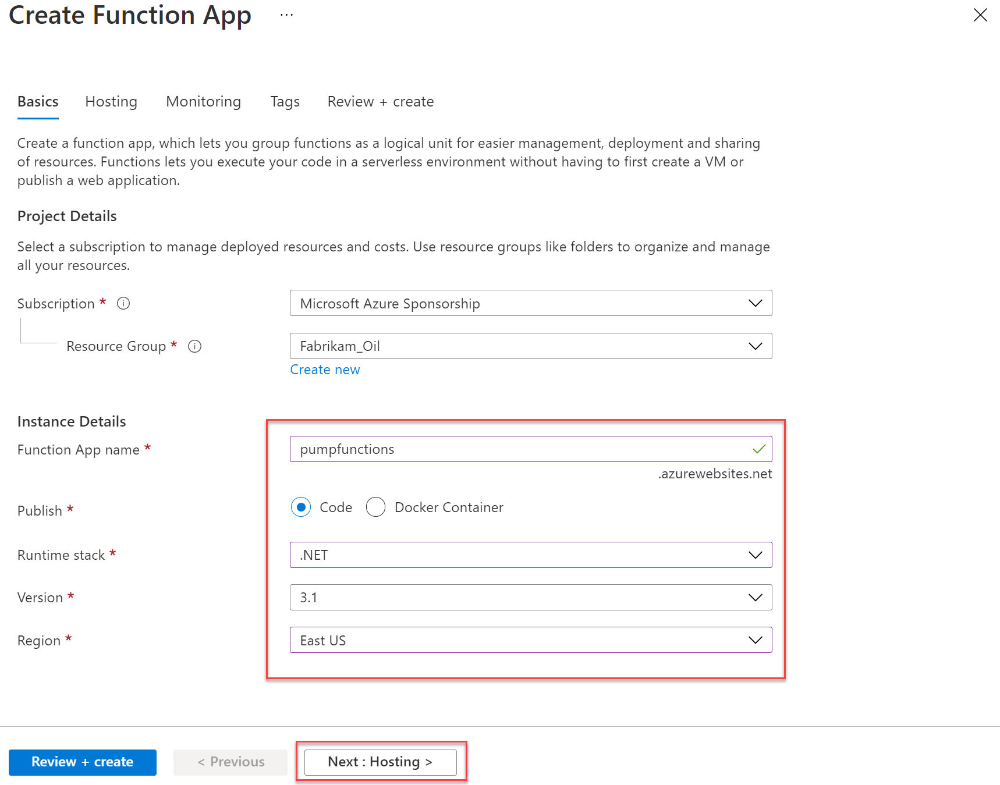

5. Configure the Hosting options as follows, then select **Review + create**:

    | Field         | Value                                           |
    | ------------- | ----------------------------------------------- |
    | Storage Account | _retain the default value of create new_ |
    | Operating System | Windows |
    | Plan Type | Consumption (Serverless)                                     |

    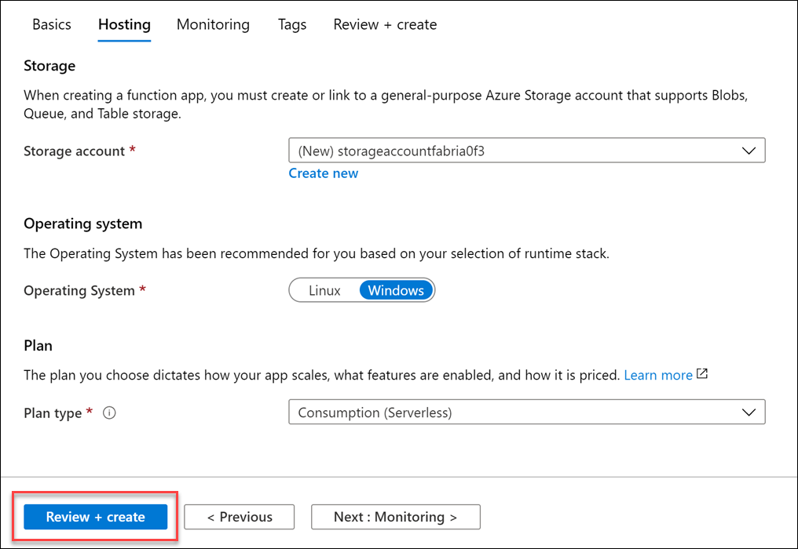

6. On the Review blade, select **Create**, then **wait until the Function App is created** before continuing.

### Task 2: Create a notification table in Azure Storage

One of the things we would like to avoid is sending repeated notifications to the workforce in the field. Notifications should only be sent once every 24-hour period per device. To keep track of when a notification was last sent for a device, we will use a table in a Storage Account.

1. In the [Azure portal](https://portal.azure.com), select **Resource groups** from the left-hand menu, then select the **Fabrikam_Oil** link from the listing.

2. Select the link for the storage account that was created with the Function App in Task 1. The name will start with "storageaccount".

   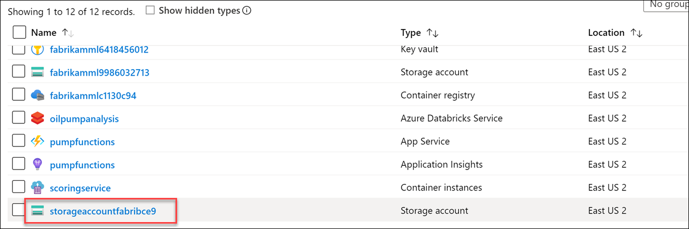

3. From the Storage Account left-hand menu, select **Tables** from the _Data storage_ section, then select the **+ Table** button, and create a new table named **DeviceNotifications**.

   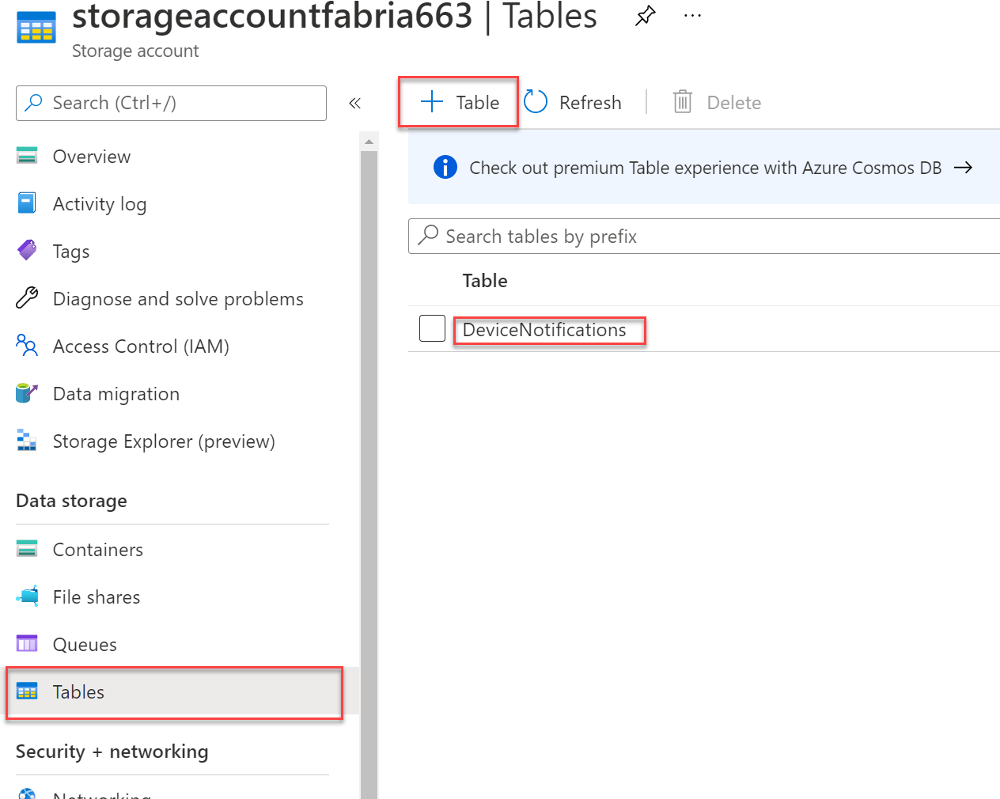

4. Keep the Storage Account open in your browser for the next task.

### Task 3: Create a notification queue in Azure Storage

There are many ways to trigger flows in Microsoft Power Automate. One of them is monitoring an Azure Queue. We will use a Queue in our Azure Storage Account to host this queue.

1. From the Storage Account left-hand menu, select **Queues** located beneath the _Data storage_ section, then select the **+ Queue** button, and create a new queue named **flownotificationqueue**.

   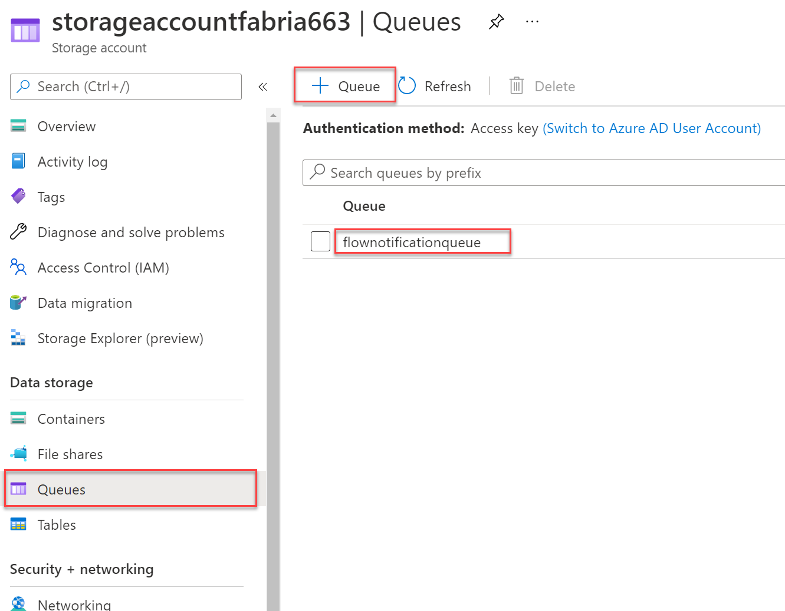

2. Navigate to the storage account. Obtain the Shared Storage Key for the storage account by selecting the left-hand menu item **Access keys**. The keys are hidden to start. Select _Show keys_ to see the keys. Copy the _Key_ value of _key1_ and retain this value. We will be using it later in the next task. Also, retain the name of your Storage Account.

   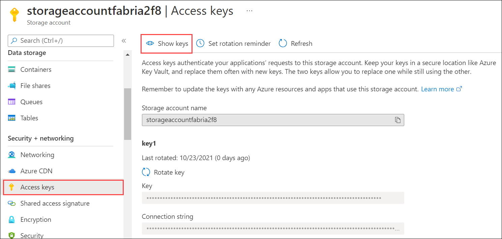

### Task 4: Create notification service in Microsoft Power Automate

We will be using [Microsoft Power Automate](https://flow.microsoft.com/) as a means to email notifications to the workforce in the field. This flow will respond to new messages placed on the queue that we created in Task 3.

1. Access [Microsoft Power Automate](https://flow.microsoft.com) and sign in (create an account if you don't already have one).

2. From the left-hand menu, select **+ Create**, then choose **Instant cloud flow**.

   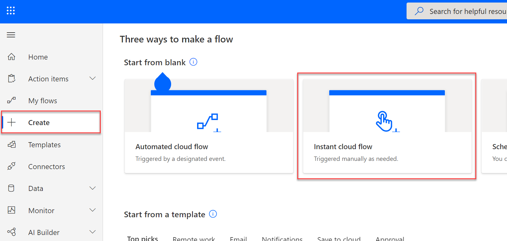

3. When the dialog displays, select the **Skip** link at the bottom to dismiss it.

   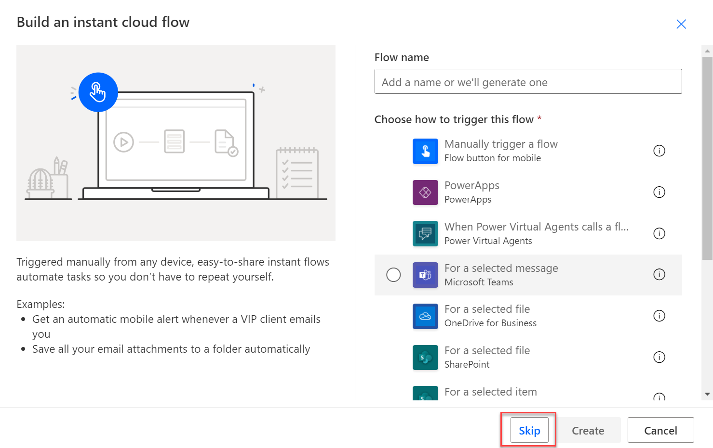

4. From the search bar, type _queue_ to filter connectors and triggers. Then, select the **When there are messages in a queue (V2)(preview)** item from the filtered list of Triggers.

   

5. Fill out the form as follows, then select the **Create** button:

   | Field                | Value                                      |
   | -------------------- | ------------------------------------------ |
   | Authentication Type  | Access Key                                 |
   | Storage Account Name | _enter the generated storage account name_ |
   | Shared Storage Key   | _paste the Key value recorded in Task 3_   |

   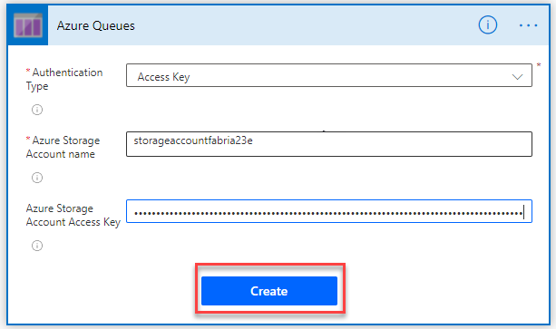

6. In the queue step, for the **Storage account name** field, select the **Use connection settings (storageaccount{SUFFIX})** item. For the **Queue Name** field, select **flownotificationqueue**. Select the **+ New step** button.

   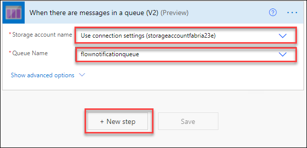

7. In the search box for the next step, search for _email_, then select the **Send an email notification (V3)** item from the filtered list of Actions.

   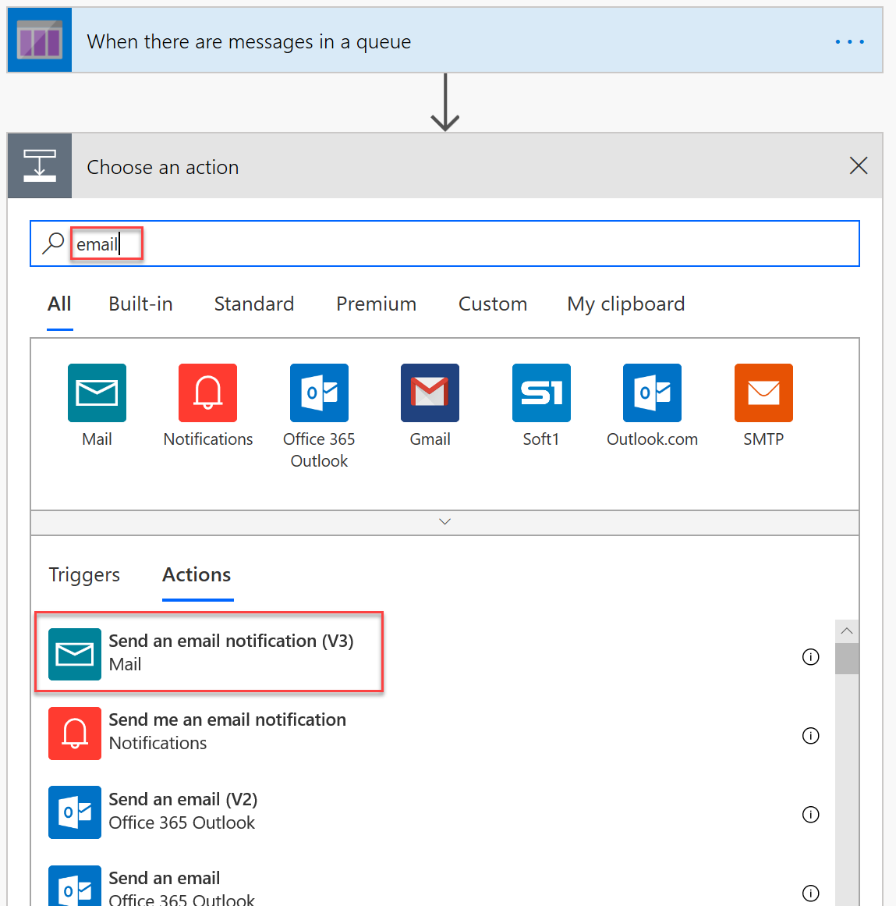

8. You may need to accept the terms and conditions of the SendGrid service, a free service that provides the underlying email capabilities of this email step.

9. In the Send an email notification (v3) form, fill it out as follows, then select the **+ New Step** button.

   | Field      | Value                                                                                |
   | ---------- | ------------------------------------------------------------------------------------ |
   | To         | _enter your email address_                                                           |
   | Subject    | Action Required: Pump needs maintenance                                              |
   | Email Body | _put cursor in the field, then select **Message Text** from the Dynamic Content menu_ |

   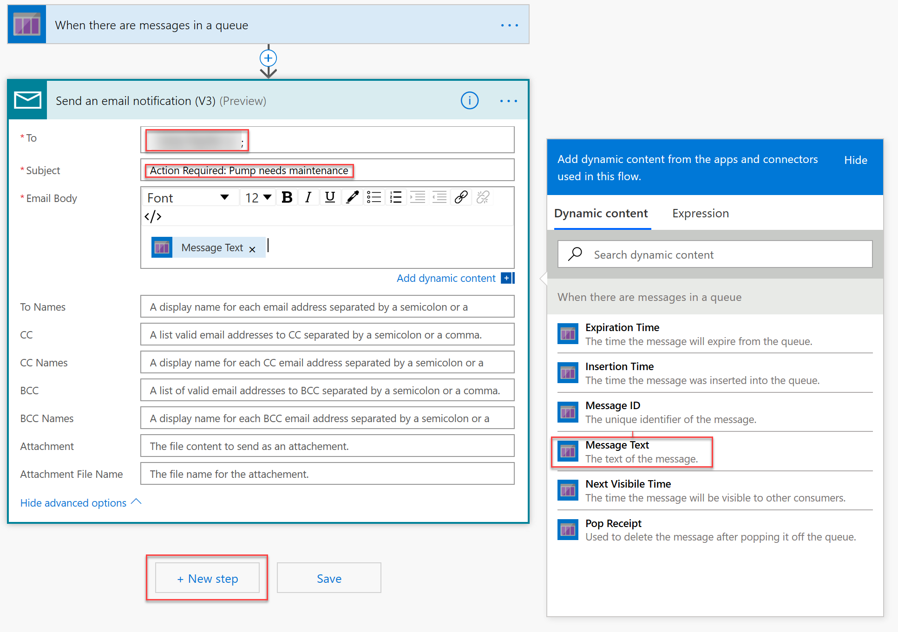

10. In the search bar for the next step, search for _queue_ once more, then select the **Delete message (V2)(preview)** item from the filtered list of Actions.

    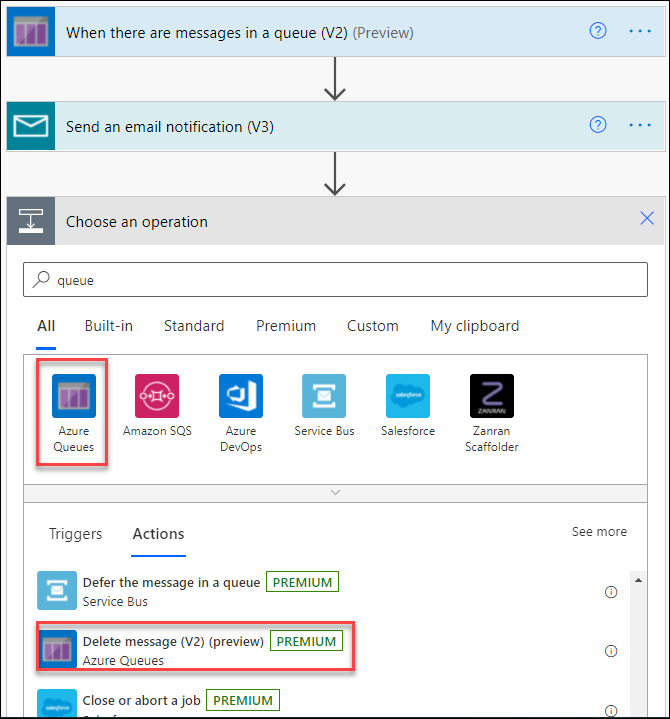

11. In the Delete message form, fill it out as follows, then select the **Save** button.

    | Field       | Value                                                                               |
    | ----------- | ----------------------------------------------------------------------------------- |
    | Queue Name  | flownotificationqueue                                                               |
    | Message ID  | _put cursor in the field, then select **Message ID** from the Dynamic Content menu_  |
    | Pop Receipt | _put cursor in the field, then select **Pop Receipt** from the Dynamic Content menu_ |

    

12. Microsoft Power Automate will automatically name the Flow. You are able to edit this Flow in the future by selecting **My flows** from the left-hand menu.

    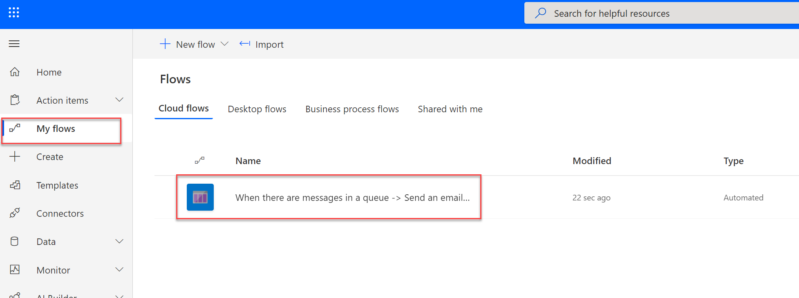

### Task 5: Obtain connection settings for use with the Azure Function implementation

1. Once the Function App has been provisioned, open the **Fabrikam_Oil** resource group and select the link for the storage account that was created with the Function App in Task 1. The name will start with "storageaccount".

   

2. From the left-hand menu, select **Access Keys** and copy the key 1 Connection String, keep this value handy as we'll be needing it in the next task.

   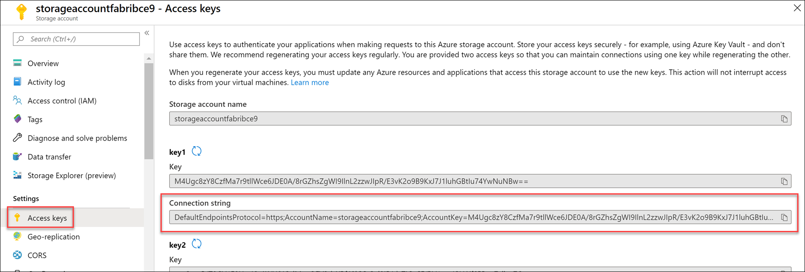

3. Return to the **Fabrikam_Oil** resource group and select the link for the Event Hubs Namespace.

   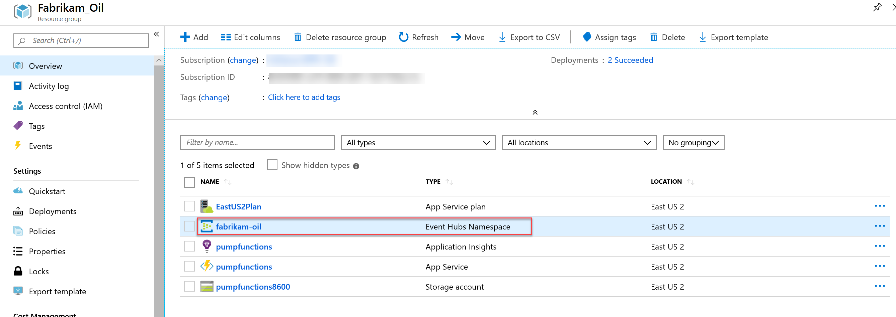

4. With the Event Hubs Namespace resource open, in the left-hand menu select the **Shared access policies** item located in Settings, then select the **RootManageSharedAccessKey** policy.

   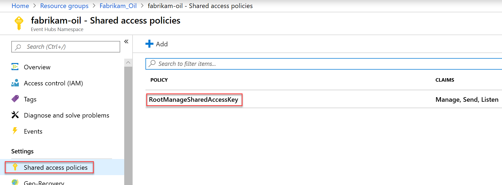

5. A blade will open where you will be able to copy the Primary Connection string. Keep this value handy as we'll be needing it in the next task.

   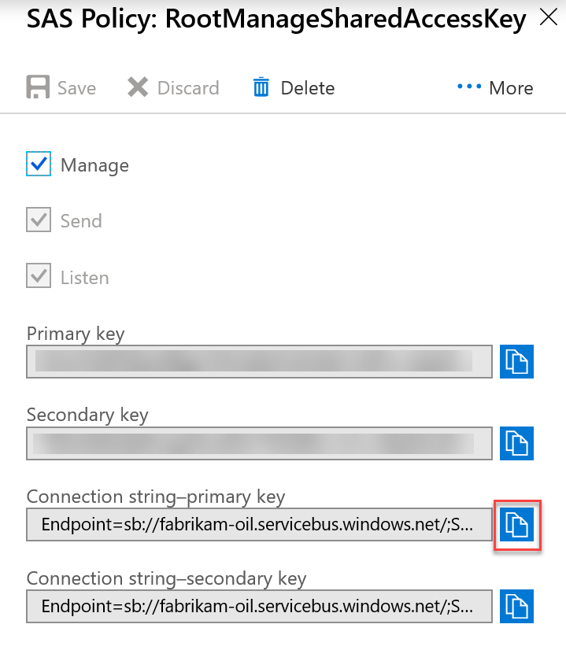

### Task 6: Create the local settings file for the Azure Functions project

It is recommended that you never check in secrets, such as connection strings, into source control. One way to do this is to use settings files. The values stored in these files mimic environment values used in production. The local settings file is never checked into source control.

1. Using Visual Studio Code, open the `C:\MCW-Predictive-Maintenance-for-remote-field-devices-master\Hands-on lab\Resources\FailurePredictionFunction` folder.

2. Upon opening the folder in Visual Studio Code, you may be prompted to restore unresolved dependencies. If this is the case, select the **Restore** button.

   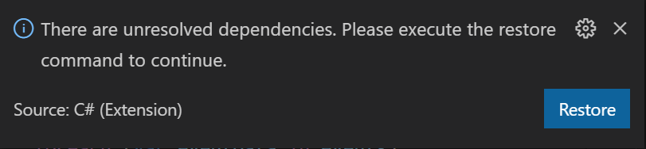

3. In this folder, create a new file named _local.settings.json_ and populate it with the values obtained in the previous task as follows, then save the file (note: prediction model endpoint was obtained in Exercise 6, Task 1 - step 8):

   ```json
   {
      "IsEncrypted": false,
      "Values": {
        "AzureWebJobsStorage": "<paste storage account connection string>",
        "FUNCTIONS_WORKER_RUNTIME": "dotnet",
        "fabrikam-oil_RootManageSharedAccessKey_EVENTHUB": "<paste event hub namespace connection string>",
        "PredictionModelEndpoint": "<paste prediction model endpoint>"
      }
   }
   ```

### Task 7: Review the Azure Function code

1. Observe the static _Run_ function located in **PumpFailurePrediction.cs**. It identifies that the function will run every time the _iot-central-feed_ event hub receives a message. It also uses a specific Consumer Group. These groups are used when there is a possibility that more than one process may be utilizing the data received in the hub. This ensures that dependent processes receive all messages once - thus avoiding any contingency problems. The method receives an array (batch) of events from the hub on each execution, as well as an instance of a logger in case you wish to see values in the console (locally or in the cloud).

   ```c#
   public static async Task Run([EventHubTrigger("iot-central-feed", Connection = "fabrikam-oil_RootManageSharedAccessKey_EVENTHUB",
                                ConsumerGroup = "ingressprocessing")] EventData[] events, ILogger log)
   ```

2. On line 29-36, the message body received from the event is deserialized into a Telemetry object. The Telemetry class matches the telemetry sent by the pumps. The Telemetry class can be found in the `Models/Telemetry.cs` file.

3. From lines 48 - 60, we group the telemetry by Device ID and calculate the averages for each sensor reading. This helps us reduce the number of calls we send to the scoring service that contains our deployed prediction model.

4. Lines 66 through 75 sends the received telemetry to the scoring service endpoint. This service will respond with a 1 - meaning the pump requires maintenance, or a 0 meaning no maintenance notifications should be sent.

5. Lines 81 through 109 checks Table storage to ensure a notification for the specific device hasn't been sent in the last 24 hours. If a notification is due to be sent, it will update the table storage record with the current timestamp and send a notification by queueing a message onto the _flownotificationqueue_ queue.

### Task 8: Run the Function App locally

1. Select <kbd>Ctrl</kbd>+<kbd>F5</kbd> to run the Azure Function code.

2. After some time, you should see log statements indicating that a message has been queued (indicating that Microsoft Power Automate will send a notification email).

   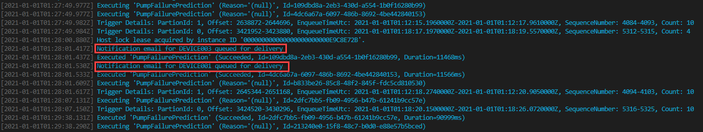

3. Once a message has been placed on the _flownotificationqueue_, it will trigger the notification flow that we created and send an email to the field workers. These emails are sent in 5-minute intervals.

   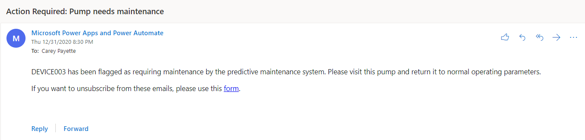

4. You can now exit the locally running functions by selecting the Terminal window by pressing the <kbd>Ctrl</kbd>+<kbd>c</kbd> keys.

### Task 9: Prepare the Azure Function App with settings

1. In Task 6, we created a local settings file to hold environment variables that are used in our function code. We need to mirror these values in the Azure Function App as well. In the Azure portal, access the **Fabrikam_Oil** resource group, and open the **pumpfunctions** Function Application.

2. Select the **Configuration** option in the left-hand menu.

   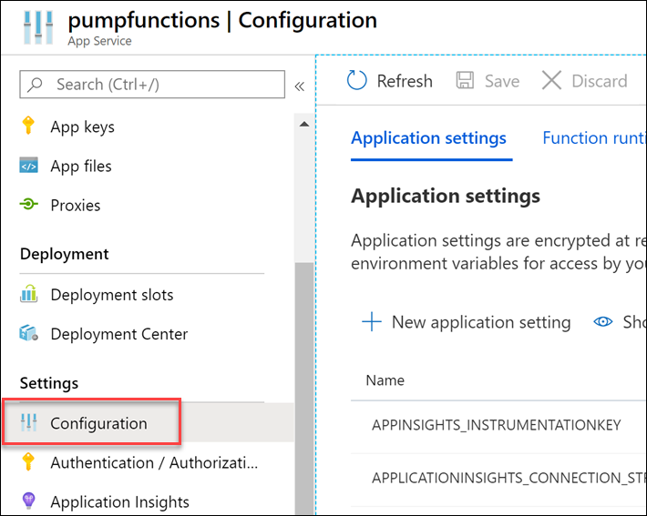

3. In the **Application Settings** section, we will add the following application settings to mimic those that are in our *local.settings.json* file. Add a new setting by selecting the **New application setting** button.

    | Setting     | Value                                                                               |
    | ----------- | ----------------------------------------------------------------------------------- |
    | fabrikam-oil_RootManageSharedAccessKey_EVENTHUB  | _event hub shared access key value from the local.settings.json file_                  |
    | PredictionModelEndpoint  | _prediction model endpoint value from local.settings.json file_   |

    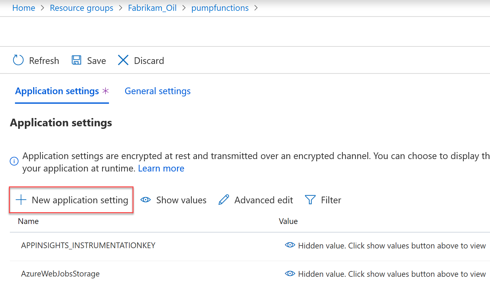

    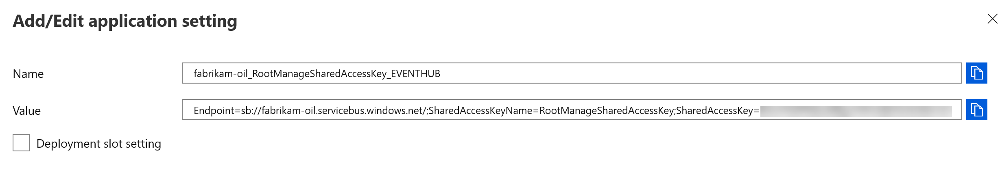

4. Once complete, select the **Save** button from the top menu to commit the changes to the application configuration.

   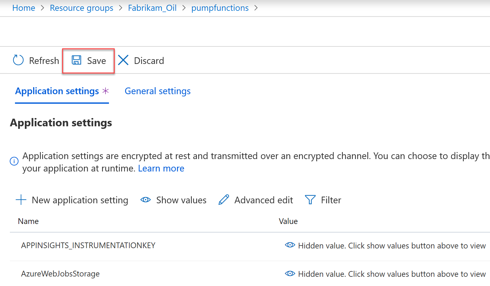

### Task 10: Deploy the Function App into Azure

1. Now that we have been able to successfully run our Functions locally, we are ready to deploy them to the cloud. The first step to deployment is to ensure that you are logged in to your Azure Account. To log into your Azure account, select the following shortcut to display the command palette: <kbd>Ctrl</kbd>+<kbd>Shift</kbd>+<kbd>p</kbd>.

2. In the textbox of the command palette, type in *Azure:Sign In*, and select enter (or select the command from the list). This will open a Microsoft Authentication webpage in your default browser. Logging into this window will authenticate Visual Studio Code with your ID.

   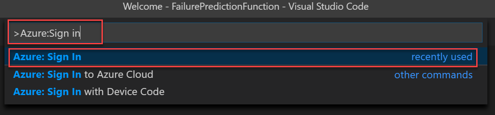

3. Once authenticated, we are ready to deploy - once again select <kbd>Ctrl</kbd>+<kbd>Shift</kbd>+<kbd>p</kbd> to open the command palette. Type *Azure Functions: Deploy* and select the *Azure Functions: Deploy to Function App* command from the list.

   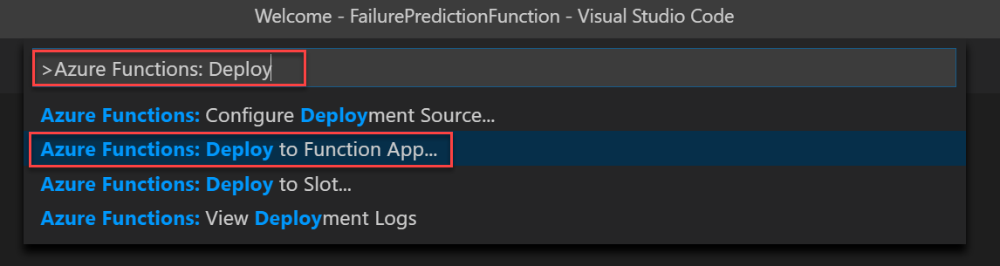

4. The first step of this command is to identify where we are deploying the function to. In our case, we have already created a Function App to house our function called **pumpfunctions**. Select this value from the list of available choices.

   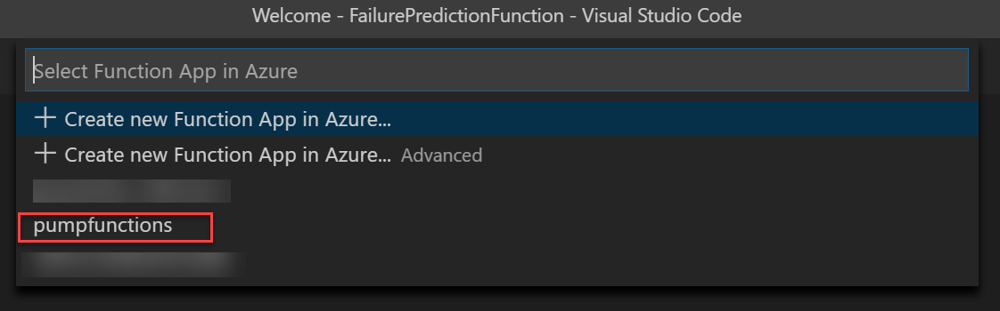

5. You may be prompted if you want to deploy to **pumpfunctions**, select the **Deploy** button in this dialog.

   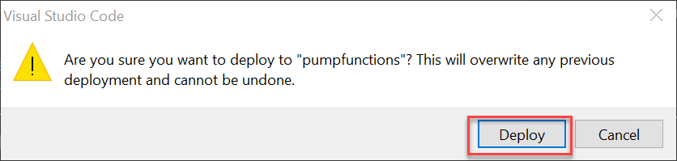

6. After some time, a notification window will display indicating the deployment has completed.

   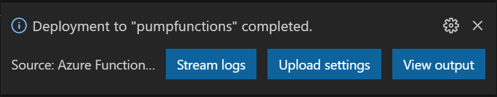

7. Returning to the Azure Portal, in the **Fabrikam_Oil** resource group, open the **pumpfunctions** function app and observe that our function that we created in Visual Studio Code has been deployed.

   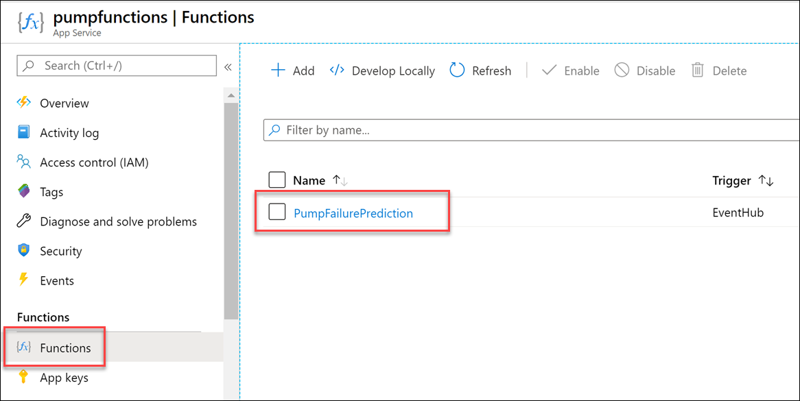

## After the hands-on lab

Duration: 10 minutes

### Task 1: Delete Lab Resources

1. In the [Azure Portal](https://portal.azure.com), select **Resource Groups**, open the resource group that you created in Exercise 6, and select the **Delete resource group** button.

   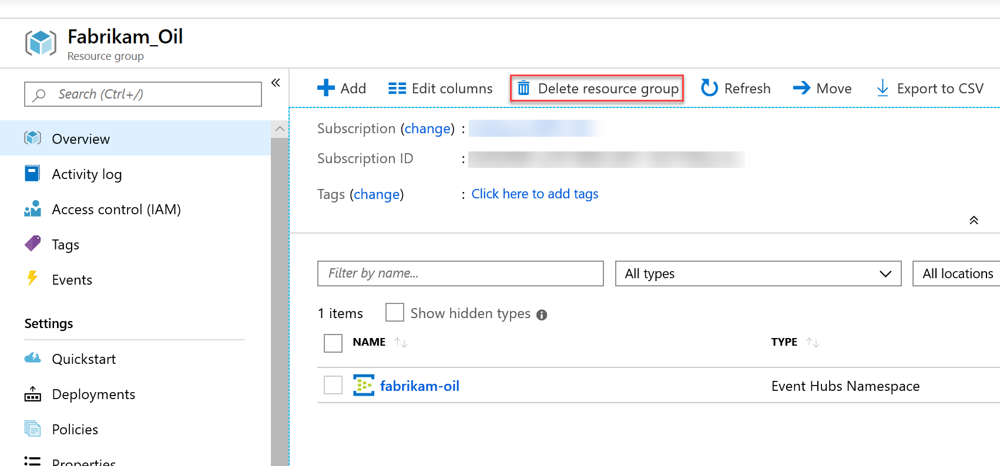

2. Delete Microsoft Power Automate flow that we created. Access [Microsoft Power Automate](https://flow.microsoft.com) and login. From the left-hand menu, select **My flows**. Select the ellipsis button next to the flow we created in this lab and select **Delete**.

   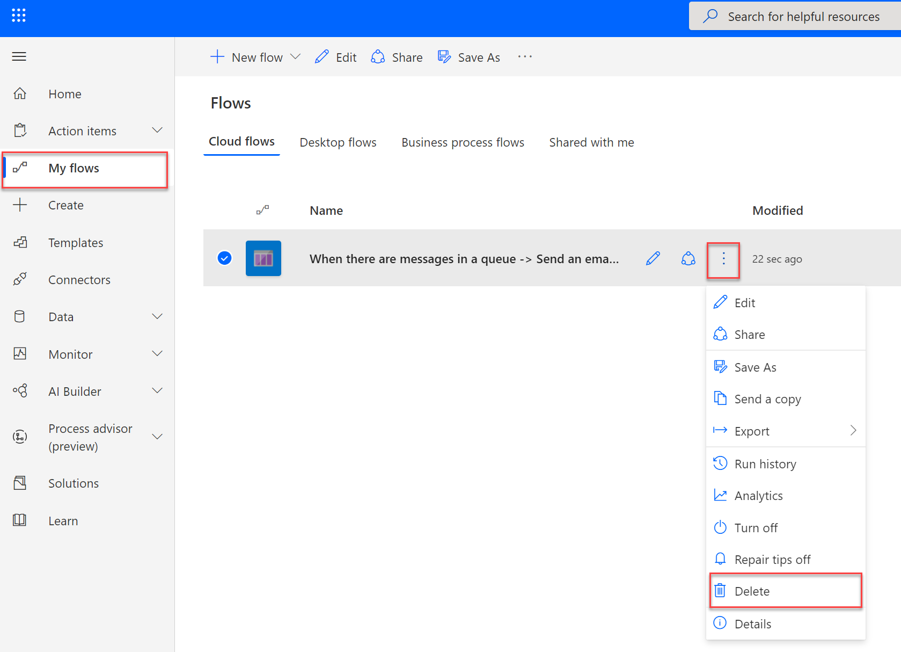

You should follow all steps provided *after* attending the Hands-on lab.
